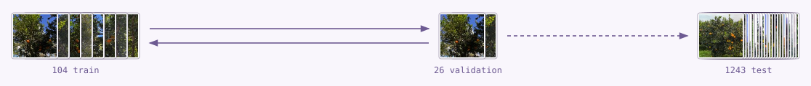
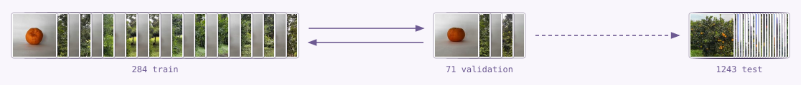
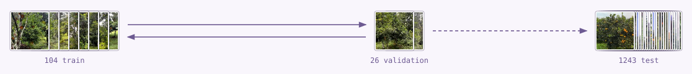
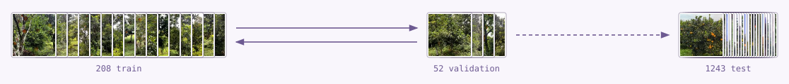
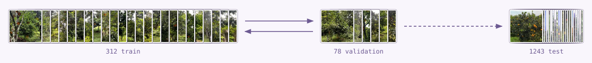
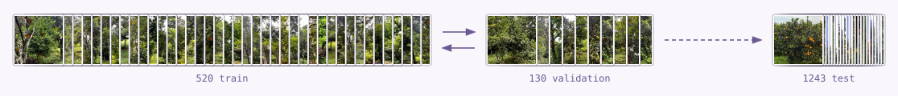
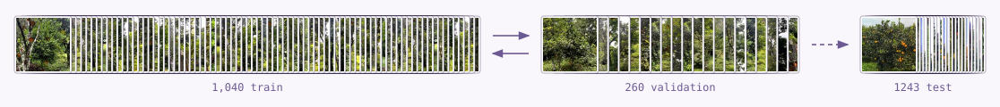
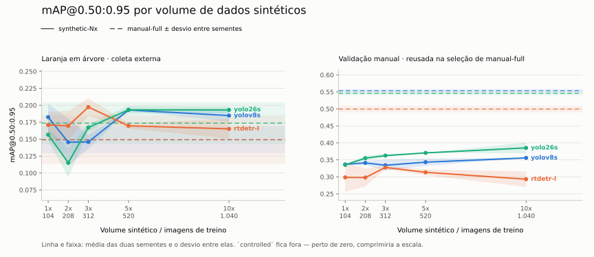

# Detecção de poncãs com dados sintéticos

Gere cenas de pomares com caixas automáticas a partir de fotos de árvores sem
frutas e recortes de poncãs. Ajuste a composição no navegador e exporte um
dataset YOLO sem desenhar as caixas à mão.

O experimento compara detectores treinados com esses dados aos treinados com
fotografias de campo. A pergunta é se o treino sintético consegue se aproximar
do treino real mantendo cenas plausíveis de pomar.

## Visualizar e criar dados

Com o ambiente e os ativos preparados, inicie a ferramenta:

```bash
.venv/bin/python scripts/studio.py
```

Abra [127.0.0.1:8765](http://127.0.0.1:8765).

1. Ajuste os sliders e confira as quatro árvores preenchidas com poncãs.
2. Ative as caixas ou amplie os detalhes para conferir inserções e oclusões.
3. Mantenha a semente para comparar ajustes nas mesmas cenas.
4. Use "Salvar receita" para baixar o YAML.
5. Use "Gerar dataset", escolha o total de imagens e a proporção de treino e baixe o ZIP.

O ZIP inclui imagens, caixas YOLO, receita e registros de reprodução. A
ferramenta usa CPU e precisa apenas dos fundos, mapas de profundidade e
recortes preparados. O usuário não precisa de um dataset real anotado.

Para abrir em outra máquina da rede, inicie com `--host 0.0.0.0` e acesse
`http://IP-DO-SERVIDOR:8765`. Veja os detalhes de
[sementes e exportação](docs/GENERATOR_STUDIO.md#sementes-e-reprodução).

## Como as cenas são geradas

O DepthPro estima a profundidade das árvores. O compositor usa esses mapas
para ajustar o tamanho das frutas e esconder parte delas atrás da vegetação.
Depois de todas as inserções, calcula as caixas das partes visíveis.

[](docs/figures/fluxograma-geracao-conjuntos-sinteticos.svg)

Abra a figura para ler os detalhes. As miniaturas ilustram o processo.
O gerador usa fotos RGB, sem exigir sensor de profundidade ou modelagem 3D.

## Ajustar o gerador

Comece pela quantidade e pelo tamanho das frutas. Depois ajuste a oclusão e
a aparência. Confira se as frutas cabem na copa, se a luz combina com o fundo
e se as bordas dos recortes continuam visíveis.

A receita oficial fica em
[`confirmatory_pool.yaml`](configs/synthesis/confirmatory_pool.yaml).
Os caminhos abaixo identificam os campos do YAML.

| O que você quer mudar | Parâmetro | Efeito na cena |
|---|---|---|
| Repetir uma composição | `seed` | Repete os sorteios com os mesmos ativos, código e bibliotecas. A receita oficial usa `42`. |
| Gerar mais imagens | `images.total` | Define o tamanho do pool. A receita oficial gera 1.300 cenas. |
| Mudar o formato | `canvas` | Define largura e altura em pixels. `[720, 960]` produz retratos. |
| Colocar mais frutas | `objects.min`, `objects.max` | Sorteia entre 1 e 30 frutas nas cenas esparsas. Inserções rejeitadas podem reduzir o total. |
| Incluir copas carregadas | `objects.dense` | Sorteia entre 60 e 110 frutas em 25% das cenas. É uma probabilidade, não uma cota exata. |
| Aproximar ou afastar as frutas | `objects.min_scale`, `objects.max_scale`, `objects.depth_scale` | Controla o tamanho inicial do recorte e sua correção pela profundidade. |
| Esconder mais fruta atrás das folhas | `placement.z_offset` | Valores mais negativos colocam a fruta atrás de regiões próximas do fundo. O mapa usa unidades de 0 a 255, não metros. |
| Rejeitar frutas quase ocultas | `placement.min_visibility` | Exige uma fração visível na inserção. O valor oficial é 0,15. Outras frutas ainda podem cobri-la depois. |
| Evitar a parte inferior da foto | `placement.exclude_bottom_fraction` | Exclui os 15% inferiores do sorteio de posições. Não identifica o chão por segmentação. |
| Variar a maturação | `appearance.ripeness` | Altera o matiz de parte dos recortes maduros para verde-amarelado. |
| Combinar a fruta com a luz local | `appearance.hsv_cast` | Aproxima cor e luminosidade da fruta das do fundo. |
| Variar sol e sombra entre frutas | `appearance.exposure_jitter` | Multiplica a intensidade por um fator entre 0,40 e 1,90 nas instâncias afetadas. |
| Suavizar o encontro com as folhas | `occlusion.edge_blur`, `occlusion.edge_feather_radius` | Suaviza a máscara de oclusão e o contorno do recorte. |
| Escolher o que a caixa cobre | `annotation.mode` | `visible` cobre a parte visível. `amodal` inclui a parte oculta. A receita usa `visible`. |

A interface exporta `sampling.mode: paired-v1`. Nesse modo, mudar a aparência
preserva os sorteios de geometria. A receita oficial usa a derivação legada,
na qual mudanças de configuração também alteram os sorteios.
Mudar quantidade, escala ou catálogo pode alterar posições e caixas.
Os manifestos registram sementes e hashes para identificar cada geração.

## Experimento

O experimento compara sete condições de treinamento. As pilhas crescem com
o número de imagens, e cada conjunto sintético contém o menor nas duas partições.

| Condição | Treino, validação e teste |
|---|---|
| `manual-full` | Fotografias de campo<br><br> |
| `controlled` | Frutas isoladas e fundos negativos<br><br> |
| `synthetic-1x` | Cenas sintéticas<br><br> |
| `synthetic-2x` | Contém synthetic-1x<br><br> |
| `synthetic-3x` | Contém synthetic-2x<br><br> |
| `synthetic-5x` | Contém synthetic-3x<br><br> |
| `synthetic-10x` | Contém synthetic-5x<br><br> |

Treino e validação usam três cartas por 26 imagens, com arredondamento.
As pilhas ficam mais compactas nos volumes maiores. As três cartas de teste
representam sempre as mesmas 119 imagens do CitDet. As miniaturas ilustram
o tipo de dado; os rótulos informam as contagens exatas.

A avaliação local também usa as 26 imagens de `manual-full.val`.
As setas entre treino e validação representam a avaliação entre épocas,
sem atualização de pesos pela validação.

### Treino e avaliação

A grade contém **42 treinos**, sete condições, três detectores e duas sementes.
A configuração completa está em
[`confirmatory.yaml`](configs/confirmatory.yaml).

| Ajuste | Valor |
|---|---|
| Detectores | YOLOv8s, YOLO26s e RT-DETR-L |
| Sementes de treino | 41 e 42 |
| Duração | Até 50 épocas, com `patience: 30` |
| Entrada | `imgsz: 960` |
| Congelamento | `freeze: 5`, os cinco primeiros módulos de cada modelo |
| YOLOs | SGD, taxa inicial 0,01, batch 8 |
| RT-DETR | AdamW, taxa inicial 0,0001, batch 2 |

Todos partem de pesos pré-treinados. O congelamento reduz os parâmetros
ajustados, mas não o tamanho do detector. Os cinco módulos não representam
a mesma estrutura nas três arquiteturas.

Cada treino escolhe seu checkpoint pela validação da própria condição.
Depois, o relatório mede mAP, precision, recall e F1 nos dois conjuntos reais.
`manual-full.val` também participa da seleção de `manual-full`. O CitDet
orientou ajustes do gerador, portanto uma confirmação independente exige
outra coleta reservada.

A grade com densidade de 25% e `freeze: 5` está em execução. Os resultados
abaixo permanecem referentes à rodada anterior até a atualização do relatório.

## Resultados e limites da interpretação

As maiores médias de mAP@0.5:0.95 entre os volumes sintéticos no CitDet foram
0,240 para YOLOv8s, 0,243 para YOLO26s e 0,212 para RT-DETR-L. As referências
`manual-full` correspondentes foram 0,214, 0,236 e 0,161. Esses máximos foram
identificados após comparar cinco volumes no próprio CitDet; não equivalem a
uma escolha prévia de condição nem demonstram superioridade estatística.



*Figura 2. Médias das duas sementes de treinamento. Linhas tracejadas indicam
`manual-full` para o mesmo detector. O eixo começa em zero, e `controlled`
aparece como referência pontilhada. A validação manual à direita foi usada
na seleção dos checkpoints de `manual-full`; não é um segundo teste externo.*

- O gerador foi calibrado com estatísticas de caixas e aparência dos conjuntos
  avaliados. O CitDet permanece externo à coleta, mas não é um teste intocado
  pelo desenvolvimento. Uma confirmação exige um novo conjunto reservado.
- `manual_full_val` reutiliza 26 imagens de validação de `manual-full`. Isso
  favorece a avaliação dessa condição por seleção de checkpoint; a magnitude
  do viés não foi estimada.
- O split sintético separa cenas, permitindo compartilhar fundos e recortes.
  A validação mede novas composições de ativos conhecidos.
- Há duas sementes de treinamento e um único pool sintético. As médias não
  estimam a variabilidade de outras coletas ou gerações independentes. Não
  foram publicados aqui intervalos de confiança ou testes de equivalência.
- Volumes maiores também trazem mais caixas, validações maiores e mais passos
  por época. O experimento não isola apenas a quantidade de imagens nem o
  efeito de cada transformação do gerador.

Os valores completos, MAE de contagem, exemplos de detecção e mapas de calor
estão em [`docs/RESULTS.md`](docs/RESULTS.md). A economia de trabalho humano e
uma margem aceitável de perda de desempenho ainda precisam ser medidas para
responder à pergunta de pesquisa.

## Preparar e executar

Use Python 3.11 ou 3.12. O treino requer GPU compatível com CUDA.
O script cria o ambiente virtual e instala as dependências.

Para preparar os dados e os ativos usados pela ferramenta:

```bash
./run_pipeline.sh prepare --device 0 --accept-data-terms
```

Para conferir a configuração sem iniciar os treinos:

```bash
./run_pipeline.sh all --dry-run --device 0 --accept-data-terms
```

Para executar a grade e liberar a avaliação após a seleção dos checkpoints:

```bash
./run_pipeline.sh all --device 0 --accept-data-terms --unlock-test
```

Repita o comando para retomar uma execução interrompida. A pipeline reutiliza
arquivos compatíveis e retoma treinos pelo último checkpoint.
Os resultados ficam em `artifacts/confirmatory/`.

As fontes, licenças, contagens e hashes estão em [DATASETS.md](docs/DATASETS.md).
Os caminhos de download ficam em [pipeline.yaml](configs/pipeline.yaml).

Para conferir o código localmente:

```bash
.venv/bin/python -m pytest -q
uvx ruff check .
```
