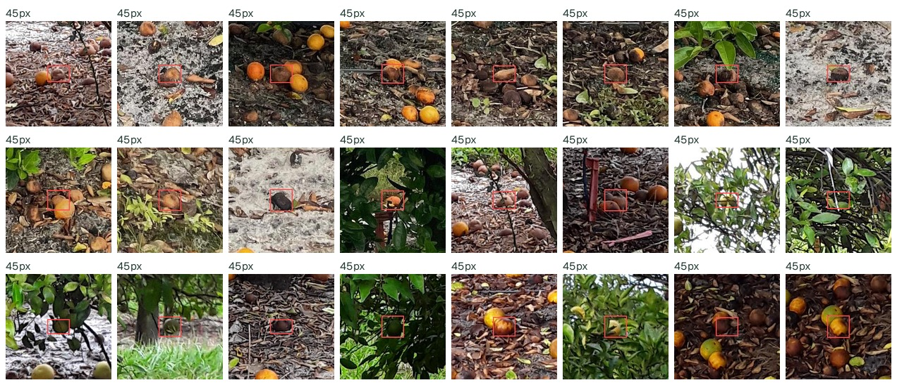
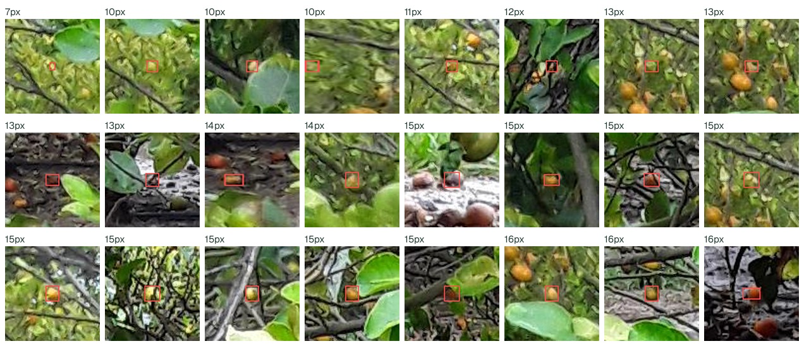
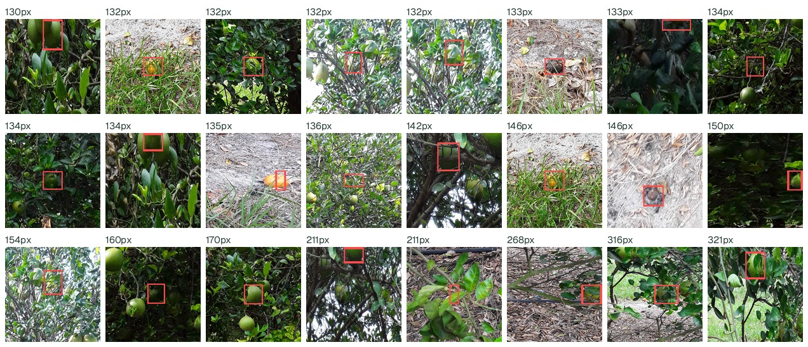
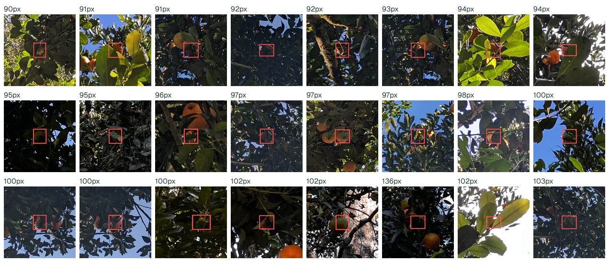
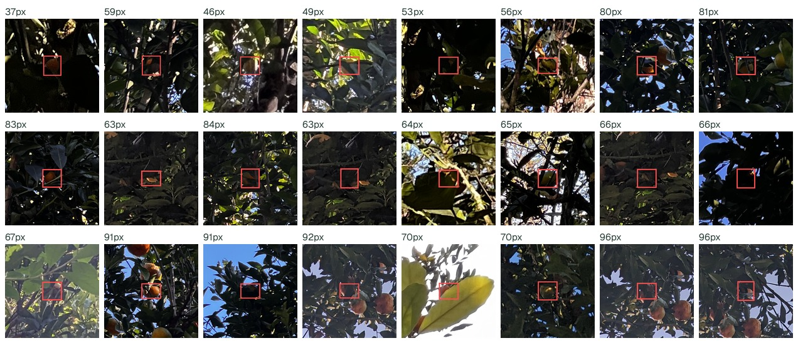
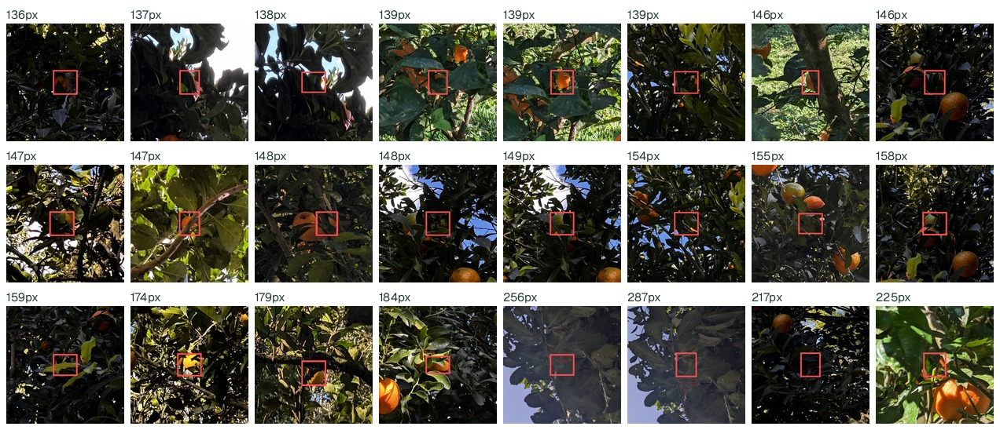

# O que o detector deixa de encontrar

Material de diagnóstico, fora do `main`: serve para inspecionar os erros e
orientar o gerador, não para descrever o experimento.

Checkpoint: `yolov8s` treinado só com sintético (receita oficial, semente de
geração 42, semente de treino 41). Casamento por IoU 0,5, `conf` 0,25. As
caixas em vermelho são gabarito que ficou **sem** predição correspondente.
Reproduza com `scripts/analyze_misses.py`.

## CitDet — 4.314 de 10.082 caixas perdidas (42,8%)

| tamanho (lado ÷ largura da imagem) | perdidas |
|---|---:|
| < 0,015 | 76,9% |
| 0,015–0,025 | 40,7% |
| 0,025–0,040 | 30,0% |
| 0,040–0,070 | 31,2% |

| vizinhos num raio de 8% da imagem | perdidas |
|---|---:|
| menos de 3 | 38,2% |
| 3 a 8 | 39,2% |
| 8 a 15 | 42,0% |
| mais de 15 | 56,5% |

Boa parte é **fruta caída no chão**, parda e meio enterrada na serrapilheira.
O gerador não produz essa categoria: toda fruta sintética está na copa,
laranja e madura.

## manual-full · val — 137 de 451 caixas perdidas (30,4%)

| tamanho | perdidas |
|---|---:|
| 0,015–0,025 | 45,9% |
| 0,025–0,040 | 31,8% |
| 0,040–0,070 | 24,5% |
| > 0,070 | 12,0% |

Aqui os erros medianos são frutas **grandes**, de 90 a 100 px, quase todas
contra céu azul em contraluz ou em sombra profunda. É exposição, não tamanho.
Os 228 fundos sintéticos são todos de céu nublado difuso.

