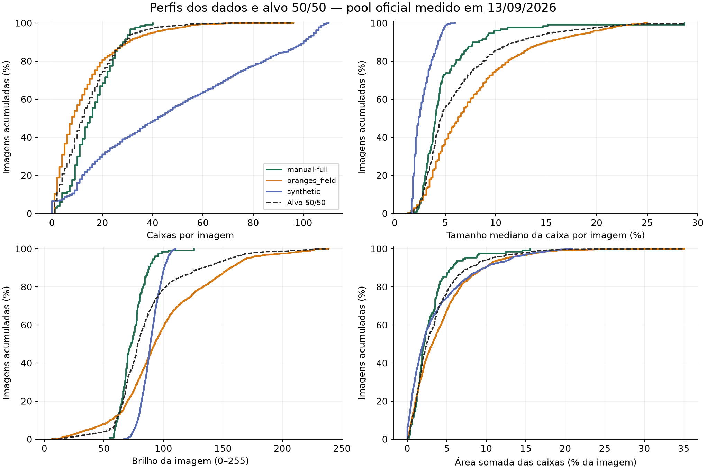

# Perfis dos datasets e alvos da receita 50/50

Medição em 13/09/2026, lendo imagens e rótulos locais. Peso solicitado: **50% manual-full + 50% oranges_field**. A receita oficial continua sendo a aprovada pelo usuário; os alvos abaixo orientam uma próxima versão.



## Contagens e tamanho das caixas

“Lado normalizado” é `max(largura_caixa/largura_imagem, altura_caixa/altura_imagem)`. São extensões das caixas anotadas, não diâmetros físicos nem superfície visível do fruto. Não há escala métrica para converter em centímetros.

| Medida | manual-full | oranges_field curado | Pool oficial |
|---|---:|---:|---:|
| Imagens | 130 | 1243 | 1300 |
| Caixas | 2093 | 15893 | 61425 |
| Imagens com rótulo vazio | 0 | 0 | 84 |
| Rótulos vazios (%) | 0,00 | 0,00 | 6,46 |
| Caixas/imagem: média | 16,10 | 12,79 | 47,25 |
| Caixas/imagem: mediana | 15,00 | 8,00 | 42,00 |
| Caixas/imagem: p95 | 31,00 | 40,00 | 105,00 |
| Lado normalizado: p5 (%) | 2,01 | 1,88 | 1,56 |
| Lado normalizado: mediana (%) | 3,65 | 4,38 | 2,64 |
| Lado normalizado: p95 (%) | 8,93 | 12,81 | 5,56 |
| Mediana do tamanho por cena (%) | 4,01 | 6,25 | 2,36 |
| Dispersão dentro da cena: mediana de p90/p10 | 1,74 | 1,67 | 1,76 |
| Dispersão entre cenas: p90/p10 das medianas | 2,82 | 4,80 | 2,38 |
| Correlação contagem × tamanho mediano | -0,39 | -0,46 | 0,25 |
| Caixas tocando borda (%) | 2,82 | 13,96 | 0,10 |
| Área somada das caixas: média (%) | 2,85 | 4,33 | 3,62 |

**O principal desajuste é a combinação de tamanho e quantidade.** O sintético tem 3,27 vezes a contagem média do alvo 50/50, com caixas menores. A área somada média quase coincide (3,62% contra 3,59% no alvo), mas esconde essa diferença. Áreas sobrepostas são contadas mais de uma vez; esse indicador não é cobertura de máscara.

Nos reais, cenas com mais caixas tendem a ter caixas menores (correlação −0,39 e −0,46); no sintético, a correlação é +0,25. A associação não prova uma causa, mas indica que sortear contagem e escala independentemente não reproduz o padrão conjunto. Rejeições por tamanho/visibilidade podem contribuir para a inversão.

As fotos manuais são 125 retratos 3024×4032 e 5 paisagens 4032×3024. O externo contém 1.242 imagens 640×640 e uma 500×494. O sintético é 720×960. Por isso o CSV também inclui o maior lado em pixels dividido pelo menor lado da imagem e a área na resolução de entrada do detector.

### Tamanho na entrada 960

Área equivalente é `sqrt(largura_px × altura_px)` depois de reduzir/ampliar o maior lado da imagem para 960, preservando a proporção. Mede a escala efetiva antes do padding; as faixas abaixo não são métricas oficiais de AP por tamanho.

| Área equivalente | manual-full | oranges_field | Pool oficial |
|---|---:|---:|---:|
| <16 px | 8,98 | 7,34 | 36,03 |
| 16–32 px | 59,10 | 30,15 | 51,14 |
| 32–96 px | 30,86 | 55,12 | 12,83 |
| ≥96 px | 1,05 | 7,39 | 0,00 |

Cada valor acima é percentual de caixas. Há quatro vezes mais caixas abaixo de 16 px no sintético do que no manual. No sintético, nenhuma chega à faixa ≥96 px.

## Negativos e integridade

O `manual-full` tem **0/130** rótulos vazios. O `oranges_field` curado tem **0/1.243**. O ZIP externo completo também tem **0/5.025**, com 43.038 caixas e nenhum rótulo ausente. A curadoria exclui negativos explicitamente, embora neste pacote não existam arquivos vazios a excluir. O zero descreve as anotações publicadas; não estima a frequência natural de fotos de pomar sem fruta e não comprova completude dos rótulos.

**Manter os 7% aprovados é uma escolha de treinamento.** A média 50/50 dos negativos observados é 0%, mas reproduzi-la eliminaria os negativos deliberados que você pediu. O pool entregou 84 negativos (6,46%): 65/1.040 no treino e 19/260 na validação. Não confundir arquivo vazio com arquivo ausente.

A validação estrutural do manual passou: 104 imagens/1.642 caixas no treino e 26/451 na validação, IDs e hashes comparados ao manifesto importado. As 130 imagens foram decodificadas. Nenhuma repetição exata de imagem, caixa duplicada, rótulo ausente ou caixa inválida foi encontrada. A inspeção humana ainda precisa verificar frutas faltantes e a extensão visual das caixas.

O externo passou na leitura/formato, mas contém **10 repetições exatas de arquivo** (1.233 hashes únicos) e **5 caixas duplicadas**. Nada foi excluído automaticamente. Os pares e imagens afetadas estão no [JSON de medições](measurements/dataset_profiles.json). Os 1.243 recortes vêm de 655 fotos; recortes da mesma foto não são observações independentes. Não foram calculados intervalos de confiança por imagem que ignorassem essa dependência.

## Como foi calculada a mistura

Cada domínio recebe metade do peso, independentemente de ter 130 ou 1.243 imagens. Dentro de um domínio, as imagens têm pesos iguais. Para estatísticas de caixas, cada imagem positiva reparte seu peso entre suas caixas: uma cena com 80 frutos não vale 80 vezes uma cena com um fruto. A mistura de quantis usa a CDF empírica ponderada (primeiro valor que atinge o percentil); **não é a média aritmética das medianas**. As tabelas descritivas de cada domínio usam percentis lineares usuais do NumPy.

Esse peso é por recorte externo, não por foto original. Uma foto com mais recortes ainda pesa mais dentro do domínio externo. O CSV inclui `source_photo` para permitir uma análise posterior com pesos por foto. A análise usa o manual completo, inclusive validação; logo orienta desenvolvimento e não constitui validação independente.

| Alvo 50/50 | p5 | p25 | mediana | p75 | p95 | média |
|---|---:|---:|---:|---:|---:|---:|
| Caixas/imagem | 1,00 | 6,00 | 12,00 | 21,00 | 34,00 | 14,44 |
| Tamanho mediano por cena (%) | 2,47 | 3,45 | 4,53 | 7,70 | 15,62 | 6,33 |
| Lado das caixas, peso por imagem (%) | 2,07 | 3,31 | 4,79 | 7,81 | 16,64 | 6,38 |
| Dispersão dentro da cena | 1,17 | 1,45 | 1,71 | 2,12 | 2,96 | 1,86 |
| Área somada (%) | 0,35 | 1,31 | 2,42 | 4,70 | 10,65 | 3,59 |
| Brilho (0–255) | 54,89 | 68,00 | 78,43 | 95,44 | 156,22 | 86,90 |
| Contraste (0–255) | 33,15 | 43,59 | 48,78 | 55,62 | 71,31 | 49,76 |
| Saturação (0–255) | 39,66 | 70,05 | 93,49 | 118,91 | 148,15 | 94,52 |

Brilho é a média de luminância `L`, contraste é seu desvio-padrão e saturação é a média do canal `S` HSV. Foram medidos na imagem inteira, reduzida a no máximo 256 px por lado maior; não distinguem fruta de fundo, iluminação física de exposição, nem maturação de balanço de branco.

| Aparência, média | manual-full | oranges_field | Pool oficial |
|---|---:|---:|---:|
| brightness | 74,10 | 99,71 | 89,30 |
| contrast | 50,61 | 48,92 | 55,40 |
| saturation | 94,19 | 94,85 | 107,56 |

O brilho médio do pool (89,30) já está perto do alvo (86,90), mas sua faixa p5–p95 é muito estreita: 75,37–103,71 contra 54,89–156,22. Contraste e saturação médios estão acima do alvo. Isso sugere ampliar a variedade de condições por cena antes de aplicar uma correção global forte. Maturação, podridão e oclusão não podem ser quantificadas confiavelmente a partir de caixas YOLO; os percentuais da receita são escolhas visuais preservadas.

## Condições do oranges_field curado

| Condição | Imagens | Caixas | Mediana caixas/imagem | Mediana lado (%) |
|---|---:|---:|---:|---:|
| AC | 250 | 3996 | 8.5 | 3.44 |
| AR | 13 | 164 | 12.0 | 7.81 |
| AS | 250 | 4134 | 13.0 | 3.75 |
| EC | 34 | 150 | 3.0 | 10.62 |
| ES | 224 | 1980 | 6.0 | 6.88 |
| MC | 126 | 2784 | 21.0 | 4.38 |
| MS | 250 | 1823 | 4.0 | 7.19 |
| NI | 96 | 862 | 8.0 | 9.69 |

AC: tarde nublada; AR: tarde chuvosa; AS: tarde ensolarada; EC: fim de tarde nublado; ES: fim de tarde ensolarado; MC: manhã nublada; MS: manhã ensolarada; NI: noite. O domínio externo recebe 50% ao todo; essas condições não têm pesos iguais dentro dele.

## Orientação para a próxima receita

1. **Preservar a base visual aprovada:** gradação com variação por cena, HSV cast local, exposição 0,82–1,27, maturação em gradiente (25%), podridão (12%), sombras com direção por cena, espelhamento 50%, chão liberado, visibilidade 20% e piso de 90 pixels. Nenhuma medição de caixas sustenta mudar esses percentuais de maturação/podridão.
2. **Reduzir a densidade entregue.** O alvo positivo tem mediana 12 caixas, p95 34 e p99 53. Com 7% de negativos extras e as demais cenas seguindo o alvo positivo, a média global seria 13,43. Se o objetivo for manter 14,44 incluindo esses negativos, as cenas positivas precisam ter média 15,53. Esses são dois objetivos distintos a escolher na próxima calibração.
3. **Aumentar tamanho e diversidade entre cenas.** A mediana do tamanho por cena precisa sair de 2,36% para perto de 4,53%. Multiplicar a escala por cerca de 1,9 é uma hipótese inicial de sondagem, não uma calibração validada: oclusão, recorte, formato e piso de 90 pixels tornam a relação não linear. Um único intervalo log-uniforme estreito dificilmente cobre simultaneamente os dois cenários e a cauda de fotos próximas.
4. **Amostrar contagem e tamanho juntos.** Usar pares de contagem/escala de cena derivados do perfil, escolhendo primeiro manual ou externo com probabilidade 50/50, preservaria a relação negativa observada. A atual curva em U entre 10 e 110 pede cenas densas demais e praticamente não cobre cenas com 1–5 caixas. Reduzir apenas o máximo sem verificar a distribuição final é insuficiente.
5. **Manter a variação interna moderada.** A mediana de p90/p10 do pool é 1,76 e a do alvo 1,71: o mecanismo `scene_scale.spread: 2.24` já está próximo. O principal ganho está em variar o centro entre cenas, não em embaralhar mais os tamanhos dentro de cada cena.
6. **Investigar a borda.** Apenas 0,10% das caixas sintéticas toca uma borda, contra 2,82% no manual e 13,96% no externo. O recorte externo contribui para isso. Truncamento por enquadramento é um mecanismo a avaliar; não deve ser confundido com oclusão por folhas.
7. **Gerar uma sondagem antes de treinar.** Conferir alvos de caixas entregues, negativos, correlação contagem/escala, aparência e auditoria visual, mantendo as sementes. Os números medidos guiam uma receita candidata; não demonstram ganho de mAP.

## Arquivos e reprodução

- [Medições completas em JSON](measurements/dataset_profiles.json): quantis, extremos, desvios, splits, condições, resoluções, duplicatas e hashes.
- [Validação do manual](measurements/manual_validation.json) e [comparação amostral da simplificação](measurements/simplification_reproduction.json).
- `artifacts/dataset_profiles/images.csv`: uma linha por imagem, incluindo contagem, escala de cena, brilho, contraste, saturação e hashes.
- `artifacts/dataset_profiles/boxes.csv`: uma linha por caixa, incluindo largura/altura em pixels e normalizadas, área, proporção, centro e escala em 960.
- [Registro da limpeza](measurements/cleanup.json): caminhos removidos e volume lógico; não contém as tabelas antigas de experimentos.

```bash
.venv/bin/python scripts/validate_data.py --stage real
.venv/bin/python scripts/measure_dataset_profiles.py --manual-weight 0.5
.venv/bin/python scripts/plot_dataset_profiles.py
```

O último comando requer matplotlib, disponível no extra `diagrams`. Os CSVs ficam fora do Git; o script os reproduz. A auditoria humana completa está disponível nas [filas de treino e validação](RESULTS.md#auditar-manual-full).

**Protocolo:** a coleta externa já orienta o desenvolvimento. Após usar essas estatísticas para calibrar o gerador, ela não pode sustentar sozinha uma alegação de generalização independente; será preciso outro conjunto intocado. Não alteramos os rótulos reais nem promovemos automaticamente uma nova receita.
