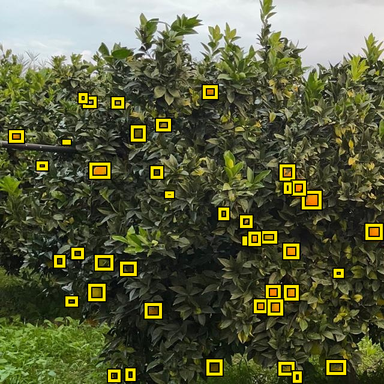
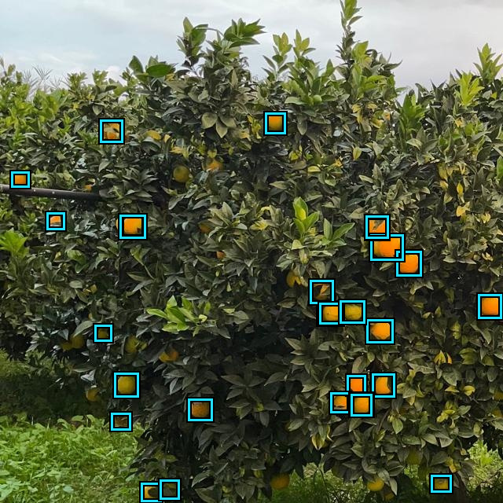
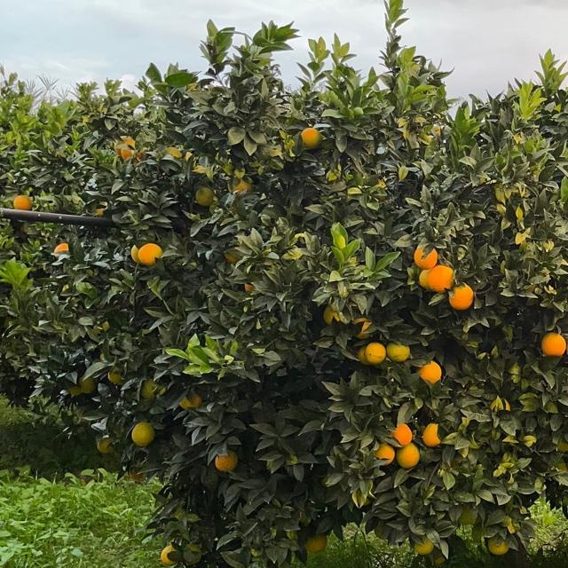
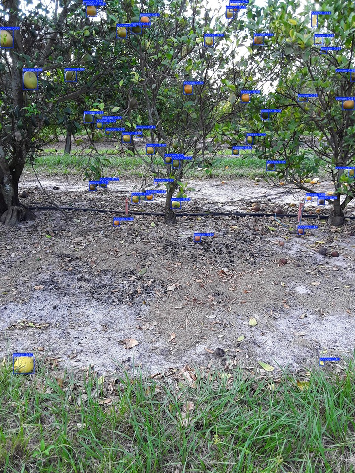
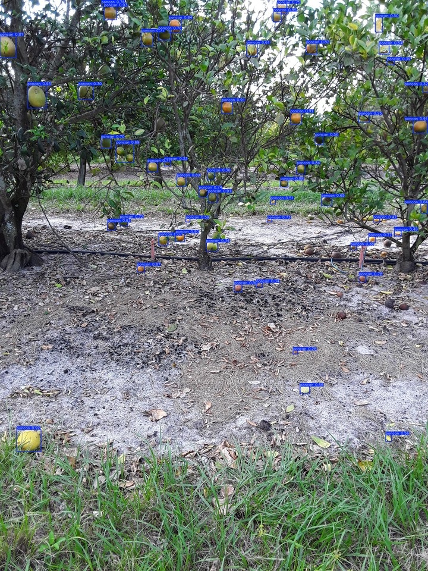
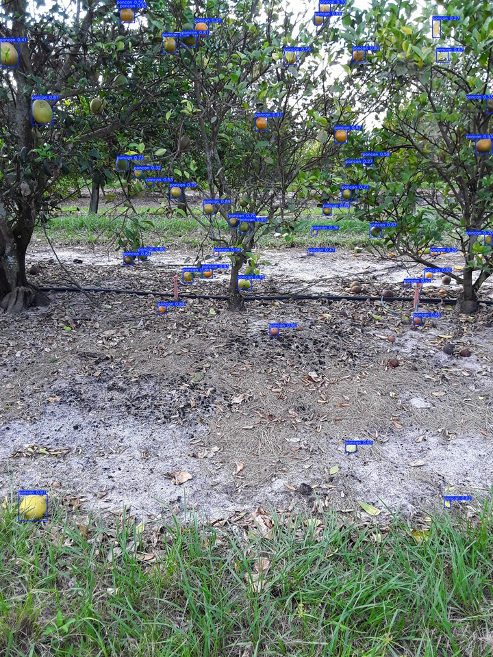

# Resultados da fase confirmatória

Consolida os resultados dos 42 treinamentos (7 condições × 3 detectores × 2
sementes, protocolo em [`configs/confirmatory.yaml`](../configs/confirmatory.yaml))
contra dois testes externos, nunca usados em treino ou seleção de checkpoint:

| Teste | O que é | Por que importa |
|---|---|---|
| **CitDet** | 119 imagens / 10.082 caixas do split de teste oficial do [CitDet](https://mavmatrix.uta.edu/cse_datasets/1/) — outro pomar, outra câmera, outra equipe de coleta | mede generalização para um domínio totalmente alheio |
| **manual-full · val** | as 26 imagens / 451 caixas de validação do split `manual-full` — mesmo pomar/câmeras usados para fotografar os fundos e frutas que viraram os conjuntos sintéticos | mede generalização dentro do mesmo domínio de captura, sem o ruído de outra fonte |

`manual-full · val` ainda carrega um viés leve — sinalizado abaixo — porque a
época/checkpoint da condição `manual-full` foi selecionada observando essas
mesmas 26 imagens.

## Como reproduzir

Além do fluxo padrão do [`README.md`](../README.md#execução), os dois testes
externos usados aqui foram registrados em `external_datasets` de
[`configs/pipeline.yaml`](../configs/pipeline.yaml) (`citdet`, já documentado no
README, e `manual_full_val`, que aponta para o próprio split de validação do
`manual-full`) e avaliados sem retreinar nada:

```bash
./run_pipeline.sh test --device 0 --unlock-test --external-name citdet
./run_pipeline.sh test --device 0 --unlock-test --external-name manual_full_val
./run_pipeline.sh report --external-name citdet
./run_pipeline.sh report --external-name manual_full_val
.venv/bin/python scripts/plot_confirmatory_results.py
```

O último comando gera o gráfico e as tabelas deste documento a partir de
`artifacts/confirmatory/test_results_{citdet,manual_full_val}.json` — que por
sua vez seguem o padrão gitignored do projeto (reproduzíveis, não versionados).
Relatórios completos com curvas de treino e CSVs detalhados:
`artifacts/confirmatory/RESULTS_citdet.md` e `RESULTS_manual_full_val.md`.

### Baixar os pesos treinados (sem retreinar)

Os 42 checkpoints (`best.pt`) da fase confirmatória e o `model_selection.json`
correspondente estão publicados como asset de release — validados por
SHA-256 em [`configs/pipeline.yaml`](../configs/pipeline.yaml) (`confirmatory_checkpoints`).
Num computador novo, depois de preparar os dados (`./run_pipeline.sh prepare
--device 0 --accept-data-terms`, que só baixa/organiza dados — não treina):

```bash
.venv/bin/python scripts/download_weights.py
```

Isso baixa o ZIP, valida o hash, extrai cada checkpoint em
`runs/confirmatory/training/<run_id>/weights/best.pt` e escreve
`artifacts/confirmatory/model_selection.json` já com os caminhos corrigidos
para a máquina local (os caminhos originais são absolutos e específicos de
onde o treino rodou). A partir daí, `evaluate_test.py`, `generate_report.py` e
`scripts/plot_confirmatory_results.py` funcionam normalmente contra qualquer
teste externo novo, sem rodar `train`/`select`:

```bash
./run_pipeline.sh prepare-test --external-name <nome> --external-source <arquivo>
./run_pipeline.sh test --device 0 --unlock-test --external-name <nome>
./run_pipeline.sh report --external-name <nome>
```

Release: https://github.com/Kastango/synthetic-fruit-detection-dataset-generation/releases/tag/confirmatory-checkpoints-v3

## Como mais dados sintéticos afetam o mAP


- **`controlled` fica fora de escala nos dois gráficos** (mAP ≈ 0.00–0.01 nos
  dois testes) — um detector treinado com frutas isoladas sobre fundo uniforme
  não generaliza para árvore real, em nenhum domínio de teste. Ver tabela completa abaixo.
- **A relação entre volume sintético e mAP depende do detector.** Os dois YOLO
  atingem o melhor resultado já em `synthetic-2x` no CitDet e ficam num platô
  depois disso. O RT-DETR foge do padrão: melhora de forma monotônica até
  `synthetic-10x`, sem sinal de saturação no intervalo testado.
- **No CitDet o sintético supera o dado real nos três detectores.** yolov8s
  0,240 contra 0,214; yolo26s 0,243 contra 0,236; RT-DETR 0,212 contra 0,161.
  Já no `manual-full · val` — que compartilha câmera e pomar com o próprio
  treino de `manual-full` — o dado real continua à frente nos três (0,469–0,552
  contra 0,330–0,413), o que sugere que essa vantagem é vantagem de coleta, não
  superioridade geral do dado anotado manualmente.

## Tabela completa

⚠️ = a linha usa checkpoints da condição `manual-full`, cuja época/checkpoint
foi selecionado(a) observando exatamente essas 26 imagens de validação — viés
otimista leve (sem gradiente nelas, mas com seleção de modelo). Nenhuma outra
condição viu qualquer imagem de `manual-full` durante treino ou seleção.

### CitDet (externo, outro pomar/câmera)

| Detector | Condição | P | R | F1 | mAP@.50 | mAP@.75 | mAP@.50:.95 | Count MAE |
|---|---|---:|---:|---:|---:|---:|---:|---:|
| yolov8s | manual-full | 0.710 | 0.488 | 0.578 | 0.529 | 0.123 | 0.214 | 45.1 |
| yolov8s | controlled | 0.000 | 0.000 | 0.000 | 0.000 | 0.000 | 0.000 | 84.7 |
| yolov8s | synthetic-1x | 0.732 | 0.514 | 0.603 | 0.572 | 0.144 | 0.236 | 35.2 |
| yolov8s | 🏆 **synthetic-2x** | 0.730 | 0.523 | 0.609 | 0.576 | 0.150 | **0.240** | 33.8 |
| yolov8s | synthetic-3x | 0.722 | 0.507 | 0.596 | 0.556 | 0.123 | 0.221 | 32.4 |
| yolov8s | synthetic-5x | 0.745 | 0.504 | 0.601 | 0.568 | 0.142 | 0.235 | 36.7 |
| yolov8s | synthetic-10x | 0.743 | 0.502 | 0.599 | 0.564 | 0.141 | 0.233 | 35.0 |
| rtdetr-l | manual-full | 0.578 | 0.414 | 0.479 | 0.423 | 0.078 | 0.161 | 54.8 |
| rtdetr-l | controlled | 0.000 | 0.000 | 0.000 | 0.000 | 0.000 | 0.000 | 84.7 |
| rtdetr-l | synthetic-1x | 0.613 | 0.419 | 0.498 | 0.429 | 0.099 | 0.172 | 45.3 |
| rtdetr-l | synthetic-2x | 0.634 | 0.480 | 0.547 | 0.494 | 0.091 | 0.184 | 27.2 |
| rtdetr-l | synthetic-3x | 0.628 | 0.468 | 0.536 | 0.476 | 0.093 | 0.181 | 42.0 |
| rtdetr-l | synthetic-5x | 0.677 | 0.499 | 0.574 | 0.524 | 0.118 | 0.207 | 33.6 |
| rtdetr-l | 🏆 **synthetic-10x** | 0.706 | 0.515 | 0.595 | 0.544 | 0.116 | **0.212** | 26.9 |
| yolo26s | manual-full | 0.718 | 0.523 | 0.606 | 0.576 | 0.130 | 0.236 | 42.3 |
| yolo26s | controlled | 0.279 | 0.035 | 0.062 | 0.030 | 0.002 | 0.009 | 84.7 |
| yolo26s | synthetic-1x | 0.720 | 0.511 | 0.598 | 0.570 | 0.136 | 0.232 | 40.6 |
| yolo26s | 🏆 **synthetic-2x** | 0.739 | 0.525 | 0.614 | 0.588 | 0.151 | **0.243** | 30.5 |
| yolo26s | synthetic-3x | 0.727 | 0.520 | 0.606 | 0.573 | 0.145 | 0.236 | 33.6 |
| yolo26s | synthetic-5x | 0.737 | 0.503 | 0.598 | 0.559 | 0.139 | 0.230 | 32.3 |
| yolo26s | synthetic-10x | 0.717 | 0.507 | 0.594 | 0.557 | 0.142 | 0.232 | 34.4 |

🏆 = maior mAP@.50:.95 para aquele detector, nesse teste.

### manual-full · val (26 imgs, real, mesmo domínio dos fundos sintéticos)

| Detector | Condição | P | R | F1 | mAP@.50 | mAP@.75 | mAP@.50:.95 | Count MAE |
|---|---|---:|---:|---:|---:|---:|---:|---:|
| yolov8s | 🏆 **manual-full** ⚠️ | 0.925 | 0.814 | 0.866 | 0.896 | 0.602 | **0.549** | 2.3 |
| yolov8s | controlled | 0.000 | 0.000 | 0.000 | 0.000 | 0.000 | 0.000 | 17.3 |
| yolov8s | synthetic-1x | 0.782 | 0.595 | 0.674 | 0.681 | 0.433 | 0.400 | 4.6 |
| yolov8s | synthetic-2x | 0.778 | 0.618 | 0.689 | 0.693 | 0.417 | 0.400 | 4.7 |
| yolov8s | synthetic-3x | 0.769 | 0.595 | 0.671 | 0.676 | 0.396 | 0.390 | 4.5 |
| yolov8s | synthetic-5x | 0.810 | 0.594 | 0.685 | 0.693 | 0.391 | 0.394 | 4.2 |
| yolov8s | synthetic-10x | 0.781 | 0.606 | 0.682 | 0.681 | 0.421 | 0.396 | 4.9 |
| rtdetr-l | 🏆 **manual-full** ⚠️ | 0.823 | 0.775 | 0.798 | 0.797 | 0.518 | **0.469** | 2.2 |
| rtdetr-l | controlled | 0.004 | 0.032 | 0.006 | 0.001 | 0.000 | 0.000 | 17.3 |
| rtdetr-l | synthetic-1x | 0.715 | 0.507 | 0.591 | 0.550 | 0.333 | 0.313 | 5.0 |
| rtdetr-l | synthetic-2x | 0.695 | 0.476 | 0.560 | 0.533 | 0.299 | 0.287 | 5.6 |
| rtdetr-l | synthetic-3x | 0.771 | 0.500 | 0.607 | 0.573 | 0.345 | 0.327 | 6.9 |
| rtdetr-l | synthetic-5x | 0.707 | 0.527 | 0.603 | 0.576 | 0.342 | 0.330 | 6.8 |
| rtdetr-l | synthetic-10x | 0.784 | 0.499 | 0.610 | 0.570 | 0.347 | 0.330 | 6.5 |
| yolo26s | 🏆 **manual-full** ⚠️ | 0.911 | 0.815 | 0.860 | 0.894 | 0.618 | **0.552** | 2.4 |
| yolo26s | controlled | 0.139 | 0.041 | 0.063 | 0.021 | 0.001 | 0.007 | 17.3 |
| yolo26s | synthetic-1x | 0.734 | 0.635 | 0.680 | 0.679 | 0.419 | 0.397 | 4.9 |
| yolo26s | synthetic-2x | 0.807 | 0.640 | 0.714 | 0.706 | 0.434 | 0.412 | 4.8 |
| yolo26s | synthetic-3x | 0.823 | 0.614 | 0.703 | 0.696 | 0.437 | 0.412 | 4.5 |
| yolo26s | synthetic-5x | 0.765 | 0.650 | 0.703 | 0.699 | 0.425 | 0.409 | 4.3 |
| yolo26s | synthetic-10x | 0.783 | 0.642 | 0.705 | 0.701 | 0.443 | 0.413 | 4.0 |

🏆 = maior mAP@.50:.95 para aquele detector, nesse teste.

## Exemplos de detecção

Mesma imagem do teste CitDet (`ftp-6-60-43_fruit-drop-back-picture_1_2021-11-09-01-57-07`,
49 caixas de gabarito), avaliada com o checkpoint `yolo26s` (seed 41) de cada
condição, `conf ≥ 0.25`. Comparação qualitativa da tabela acima.

| | |
|---|---|
| **Gabarito**<br> | **manual-full**<br> |
| **controlled** — colapso visível, quase nenhuma detecção<br> | **synthetic-1x**<br> |
| **synthetic-5x**<br> | **synthetic-10x**<br> |

`synthetic-2x` e `synthetic-3x` seguem o mesmo padrão de `1x`/`5x`/`10x` — veja
`docs/figures/results/examples/` para o conjunto completo. Reproduza com
`scripts/render_detection_examples.py` (troca a imagem/modelo editando as
constantes no topo do arquivo).

## Distribuição espacial das anotações

Área das caixas acumulada em coordenadas normalizadas, média por imagem;
branco = ausência, azul→amarelo = densidade crescente. Escala de cor
compartilhada entre todos os conjuntos.

| | | |
|---|---|---|
| **manual-full** (130 img / 2.093 caixas)<br> | **controlled** (355 img / 127 caixas)<br> | **synthetic-1x** (130 img / 8.302 caixas)<br> |
| **synthetic-2x** (260 img / 18.084 caixas)<br> | **synthetic-3x** (390 img / 26.853 caixas)<br> | **synthetic-5x** (650 img / 44.284 caixas)<br> |
| **synthetic-10x** (1.300 img / 91.623 caixas)<br> | **CitDet** — teste (119 img / 10.082 caixas)<br> | **manual-full · val** — teste (26 img / 451 caixas)<br> |

`controlled` concentra as caixas numa faixa muito mais estreita do que os
demais conjuntos — mais um indício visual de por que a condição não
generaliza: a rede aprende uma composição de cena que não existe em campo. Os
conjuntos `synthetic-Nx` mostram uma dispersão mais próxima da observada no
CitDet do que a dos conjuntos reais capturados de perto (`manual-full`,
`controlled`) — reflexo de o gerador variar tanto a escala aparente da fruta
quanto a densidade de objetos por cena.

## Achados para o artigo

1. **`controlled` é um mau candidato a substituto de dado real.** Validação
   interna quase perfeita (mAP@.50:.95 ≈ 0.98) e colapso total nos dois testes
   externos (≤ 0.01) — o exemplo mais claro de overfitting de domínio do
   experimento inteiro.
2. **No teste verdadeiramente externo (CitDet), o dado sintético supera o dado
   anotado manualmente nos três detectores.** yolov8s vai de 0,214 (`manual-full`)
   para 0,240 (`synthetic-2x`); yolo26s, de 0,236 para 0,243 (`synthetic-2x`); e
   o RT-DETR, de 0,161 para 0,212 (`synthetic-10x`), o maior salto relativo
   (+32%). O ganho é maior justamente onde o dado real rende menos: o detector
   com mais capacidade é o que mais sofre com apenas 130 imagens reais e o que
   mais aproveita o volume sintético. No `manual-full · val` o dado real segue
   à frente (0,469–0,552 contra 0,330–0,413), mas esse conjunto é o split de
   validação da mesma sessão de fotos que treinou `manual-full` — mesma câmera,
   mesmo dia, mesmo pomar.
3. **A relação entre volume sintético e desempenho depende do detector.** Os
   dois YOLO já atingem o melhor resultado em `synthetic-2x` (208 imagens de
   treino) e ficam num platô. O RT-DETR melhora de forma monotônica até
   `synthetic-10x`, sem saturar no intervalo testado — pode ser diferença de
   arquitetura (atenção global vs. convolução local absorvendo melhor a
   diversidade extra) ou só dessa combinação de hiperparâmetros.
4. **Em contagem — métrica prática para estimativa de safra — o sintético
   supera o dado real no CitDet nos três detectores.** MAE de contagem:
   yolo26s 30,5 (`synthetic-2x`) contra 42,3 de `manual-full`; yolov8s 32,4
   (`synthetic-3x`) contra 45,1; RT-DETR 26,9 (`synthetic-10x`) contra 54,8.
   Mais recall compensa o viés de contagem melhor que o dado real nesse
   domínio externo.

## Rastreabilidade

- SHA-256 da seleção de checkpoints: `99c19ee9733dc63914789c962d12e84b95f142e866355815ec95dca9b997023f`
- Checkpoints avaliados por teste: 42 (todos os treinamentos confirmatórios)
- Teste aberto somente após a seleção (`model_selection.json` congelado antes de qualquer avaliação externa), nos dois testes.
