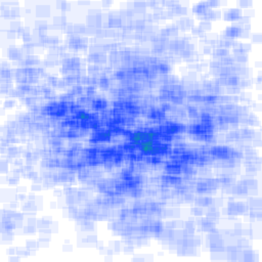
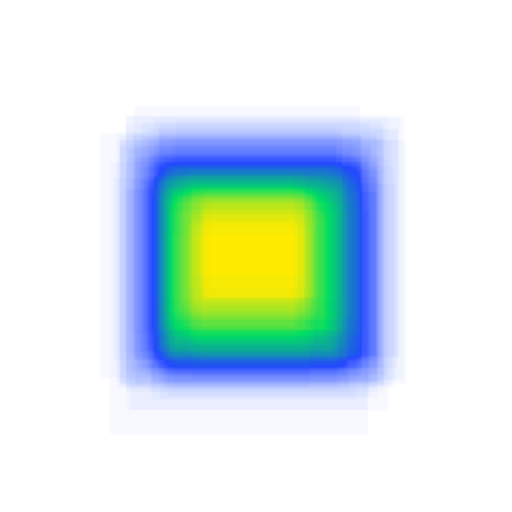
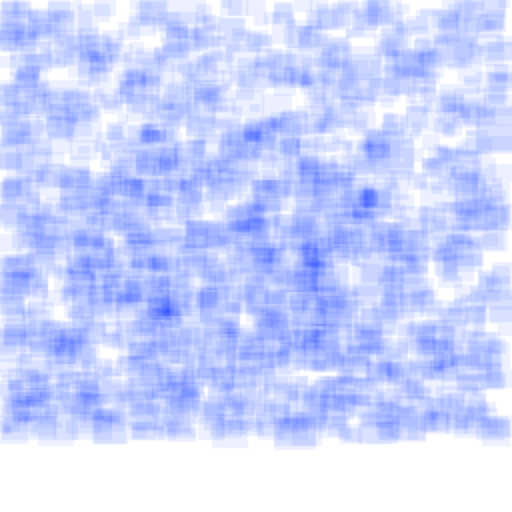
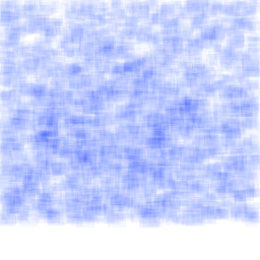
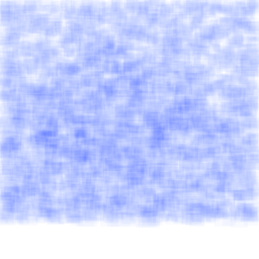
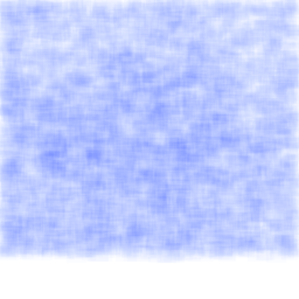
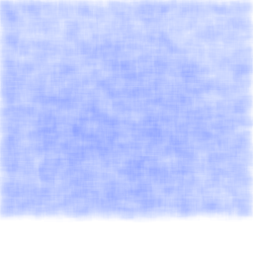
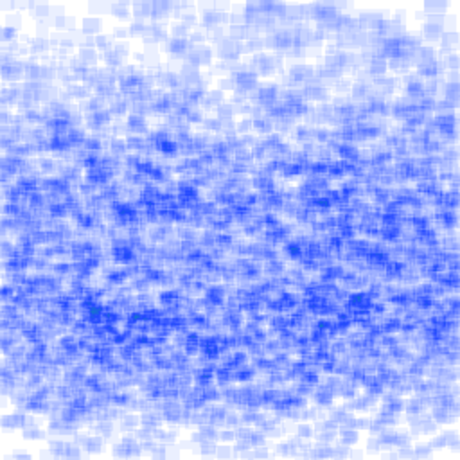
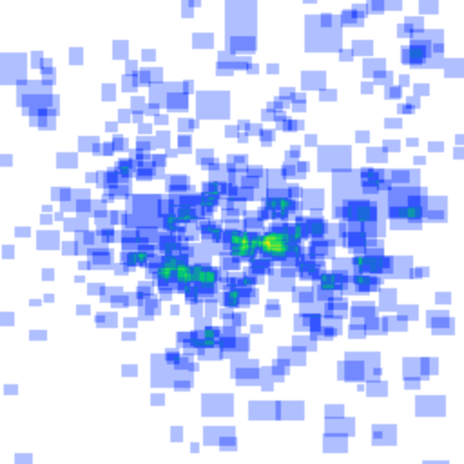

# Resultados da fase confirmatória

Consolida os resultados dos 42 treinamentos (7 condições × 3 detectores × 2
sementes, protocolo em [`configs/confirmatory.yaml`](../configs/confirmatory.yaml))
contra dois testes externos, nunca usados em treino ou seleção de checkpoint:

| Teste | O que é | Por que importa |
|---|---|---|
| **CitDet** | 119 imagens / 10.082 caixas do split de teste oficial do [CitDet](https://mavmatrix.uta.edu/cse_datasets/1/) — outro pomar, outra câmera, outra equipe de coleta | mede generalização para um domínio totalmente alheio |
| **manual-full · val** | as 26 imagens / 451 caixas de validação do split `manual-full` — mesmo pomar/câmeras usados para fotografar os fundos e frutas que viraram os conjuntos sintéticos | mede generalização dentro do mesmo domínio de captura, sem o ruído de outra fonte |

Um terceiro teste foi rodado durante a exploração (as 130 imagens completas de
`manual-full`, treino+validação) e descartado da documentação: ele inclui as
104 imagens de treino dos 6 modelos da condição `manual-full`, o que infla o
resultado desses modelos especificamente (viés de memorização). Os dois testes
acima evitam esse problema — `manual-full · val` ainda carrega um viés leve,
sinalizado abaixo.

## Como reproduzir

Além do fluxo padrão do [`README.md`](../README.md#execução), os dois testes
externos usados aqui foram registrados em `external_datasets` de
[`configs/pipeline.yaml`](../configs/pipeline.yaml) (`citdet`, já documentado no
README, e `manual_full_val`, que aponta para o próprio split de validação do
`manual-full`) e avaliados sem retreinar nada:

```bash
./run_pipeline.sh test --device 0 --unlock-test --external-name citdet
./run_pipeline.sh test --device 0 --unlock-test --external-name manual_full_val
./run_pipeline.sh report --external-name citdet
./run_pipeline.sh report --external-name manual_full_val
.venv/bin/python scripts/plot_confirmatory_results.py
```

O último comando gera o gráfico e as tabelas deste documento a partir de
`artifacts/confirmatory/test_results_{citdet,manual_full_val}.json` — que por
sua vez seguem o padrão gitignored do projeto (reproduzíveis, não versionados).
Relatórios completos com curvas de treino e CSVs detalhados:
`artifacts/confirmatory/RESULTS_citdet.md` e `RESULTS_manual_full_val.md`.

## Como mais dados sintéticos afetam o mAP


- **`controlled` fica fora de escala nos dois gráficos** (mAP ≈ 0.00–0.01 nos
  dois testes) — um detector treinado com frutas isoladas sobre fundo uniforme
  não generaliza para árvore real, em nenhum domínio de teste. Ver tabela completa abaixo.
- Nos dois testes, aumentar o volume sintético melhora o mAP até
  `synthetic-3x`/`5x` e depois estabiliza ou recua ligeiramente em `10x` —
  saturação, não crescimento monotônico.
- A distância entre o melhor sintético e `manual-full` (linha tracejada, mesma
  cor do detector) é parecida nos dois domínios: sintético fica
  sistematicamente abaixo dos dados reais anotados manualmente, mas não por
  larga margem crescente — sugere que o gap não é artefato de um dataset de
  teste específico.
- RT-DETR é o único detector em que alguma condição sintética chegou perto de
  ultrapassar `manual-full` no CitDet (`synthetic-5x`: 0.169 vs. 0.143); nos
  YOLO o gap para `manual-full` se mantém maior nos dois testes.

## Tabela completa

⚠️ = a linha usa checkpoints da condição `manual-full`, cuja época/checkpoint
foi selecionado(a) observando exatamente essas 26 imagens de validação — viés
otimista leve (sem gradiente nelas, mas com seleção de modelo). Nenhuma outra
condição viu qualquer imagem de `manual-full` durante treino ou seleção.

### CitDet (externo, outro pomar/câmera)

| Detector | Condição | P | R | F1 | mAP@.50 | mAP@.75 | mAP@.50:.95 | Count MAE |
|---|---|---:|---:|---:|---:|---:|---:|---:|
| yolov8s | manual-full | 0.710 | 0.488 | 0.578 | 0.529 | 0.123 | **0.214** | 45.1 |
| yolov8s | controlled | 0.000 | 0.000 | 0.000 | 0.000 | 0.000 | **0.000** | 84.7 |
| yolov8s | synthetic-1x | 0.702 | 0.356 | 0.472 | 0.402 | 0.098 | **0.165** | 62.4 |
| yolov8s | synthetic-2x | 0.689 | 0.348 | 0.462 | 0.391 | 0.088 | **0.155** | 61.0 |
| yolov8s | synthetic-3x | 0.679 | 0.357 | 0.468 | 0.391 | 0.107 | **0.167** | 57.8 |
| yolov8s | synthetic-5x | 0.678 | 0.347 | 0.458 | 0.382 | 0.102 | **0.160** | 59.9 |
| yolov8s | synthetic-10x | 0.666 | 0.344 | 0.453 | 0.375 | 0.095 | **0.156** | 61.9 |
| rtdetr-l | manual-full | 0.520 | 0.473 | 0.495 | 0.368 | 0.075 | **0.143** | 29.6 |
| rtdetr-l | controlled | 0.005 | 0.018 | 0.008 | 0.003 | 0.003 | **0.002** | 84.7 |
| rtdetr-l | synthetic-1x | 0.538 | 0.345 | 0.419 | 0.337 | 0.057 | **0.123** | 60.6 |
| rtdetr-l | synthetic-2x | 0.547 | 0.345 | 0.423 | 0.343 | 0.064 | **0.127** | 51.9 |
| rtdetr-l | synthetic-3x | 0.641 | 0.370 | 0.469 | 0.394 | 0.077 | **0.149** | 56.6 |
| rtdetr-l | synthetic-5x | 0.644 | 0.420 | 0.509 | 0.433 | 0.095 | **0.169** | 35.3 |
| rtdetr-l | synthetic-10x | 0.647 | 0.409 | 0.501 | 0.425 | 0.088 | **0.164** | 40.8 |
| yolo26s | manual-full | 0.718 | 0.523 | 0.606 | 0.576 | 0.130 | **0.236** | 42.3 |
| yolo26s | controlled | 0.279 | 0.035 | 0.062 | 0.030 | 0.002 | **0.009** | 84.7 |
| yolo26s | synthetic-1x | 0.719 | 0.353 | 0.473 | 0.415 | 0.099 | **0.168** | 63.8 |
| yolo26s | synthetic-2x | 0.666 | 0.387 | 0.489 | 0.423 | 0.100 | **0.170** | 58.7 |
| yolo26s | synthetic-3x | 0.683 | 0.396 | 0.502 | 0.438 | 0.111 | **0.180** | 56.0 |
| yolo26s | synthetic-5x | 0.661 | 0.386 | 0.487 | 0.418 | 0.108 | **0.173** | 56.3 |
| yolo26s | synthetic-10x | 0.664 | 0.370 | 0.476 | 0.405 | 0.097 | **0.164** | 56.2 |

### manual-full · val (26 imagens, mesmo domínio dos fundos sintéticos)

| Detector | Condição | P | R | F1 | mAP@.50 | mAP@.75 | mAP@.50:.95 | Count MAE |
|---|---|---:|---:|---:|---:|---:|---:|---:|
| yolov8s | manual-full ⚠️ | 0.925 | 0.814 | 0.866 | 0.896 | 0.602 | **0.549** | 2.3 |
| yolov8s | controlled | 0.000 | 0.000 | 0.000 | 0.000 | 0.000 | **0.000** | 17.3 |
| yolov8s | synthetic-1x | 0.778 | 0.548 | 0.643 | 0.621 | 0.356 | **0.343** | 8.5 |
| yolov8s | synthetic-2x | 0.845 | 0.526 | 0.648 | 0.647 | 0.359 | **0.360** | 6.9 |
| yolov8s | synthetic-3x | 0.814 | 0.542 | 0.651 | 0.643 | 0.375 | **0.361** | 7.3 |
| yolov8s | synthetic-5x | 0.788 | 0.564 | 0.657 | 0.647 | 0.368 | **0.361** | 6.8 |
| yolov8s | synthetic-10x | 0.799 | 0.562 | 0.660 | 0.643 | 0.368 | **0.364** | 7.3 |
| rtdetr-l | manual-full ⚠️ | 0.749 | 0.766 | 0.757 | 0.772 | 0.485 | **0.454** | 4.0 |
| rtdetr-l | controlled | 0.354 | 0.076 | 0.023 | 0.012 | 0.003 | **0.005** | 17.3 |
| rtdetr-l | synthetic-1x | 0.776 | 0.572 | 0.658 | 0.611 | 0.346 | **0.339** | 5.8 |
| rtdetr-l | synthetic-2x | 0.716 | 0.545 | 0.619 | 0.576 | 0.316 | **0.314** | 6.7 |
| rtdetr-l | synthetic-3x | 0.807 | 0.559 | 0.660 | 0.602 | 0.343 | **0.334** | 7.5 |
| rtdetr-l | synthetic-5x | 0.760 | 0.591 | 0.663 | 0.632 | 0.370 | **0.355** | 5.3 |
| rtdetr-l | synthetic-10x | 0.802 | 0.571 | 0.667 | 0.621 | 0.351 | **0.343** | 6.4 |
| yolo26s | manual-full ⚠️ | 0.911 | 0.815 | 0.860 | 0.894 | 0.618 | **0.552** | 2.4 |
| yolo26s | controlled | 0.139 | 0.041 | 0.063 | 0.021 | 0.001 | **0.007** | 17.3 |
| yolo26s | synthetic-1x | 0.808 | 0.582 | 0.675 | 0.647 | 0.393 | **0.367** | 8.2 |
| yolo26s | synthetic-2x | 0.772 | 0.589 | 0.668 | 0.644 | 0.373 | **0.361** | 7.6 |
| yolo26s | synthetic-3x | 0.815 | 0.576 | 0.675 | 0.660 | 0.393 | **0.375** | 7.6 |
| yolo26s | synthetic-5x | 0.783 | 0.550 | 0.645 | 0.629 | 0.374 | **0.352** | 8.3 |
| yolo26s | synthetic-10x | 0.787 | 0.576 | 0.664 | 0.647 | 0.394 | **0.375** | 6.8 |

## Distribuição espacial das anotações

Área das caixas acumulada em coordenadas normalizadas, média por imagem;
branco = ausência, azul→amarelo = densidade crescente. Escala de cor
compartilhada entre todos os conjuntos.

| | | |
|---|---|---|
| **manual-full** (130 img / 2.093 caixas)<br> | **controlled** (355 img / 127 caixas)<br> | **synthetic-1x** (130 img / 1.956 caixas)<br> |
| **synthetic-2x** (260 img / 3.919 caixas)<br> | **synthetic-3x** (390 img / 6.028 caixas)<br> | **synthetic-5x** (650 img / 10.146 caixas)<br> |
| **synthetic-10x** (1.300 img / 20.316 caixas)<br> | **CitDet** — teste (119 img / 10.082 caixas)<br> | **manual-full · val** — teste (26 img / 451 caixas)<br> |

`controlled` concentra as caixas numa faixa muito mais estreita do que os
demais conjuntos — mais um indício visual de por que a condição não
generaliza: a rede aprende uma composição de cena que não existe em campo.

## Achados para o artigo

1. **`controlled` é um mau candidato a substituto de dado real.** Validação
   interna quase perfeita (mAP@.50:.95 ≈ 0.98) e colapso total nos dois testes
   externos (≤ 0.01) — o exemplo mais claro de overfitting de domínio do
   experimento inteiro.
2. **Dados sintéticos compostos (synthetic-Nx) generalizam de forma consistente
   nos dois domínios de teste**, ficando sistematicamente abaixo de
   `manual-full` mas não colapsando como `controlled` — a composição
   guiada por profundidade parece preservar sinal útil para detecção em
   campo, mesmo sem modelagem 3D.
3. **Mais dado sintético não é sempre melhor**: o ganho satura por volta de
   `3x`–`5x` nos dois testes; `10x` não supera `5x` de forma consistente entre
   detectores. Vale investigar se isso é um teto do gerador (diversidade de
   cena finita) ou do tamanho do conjunto de validação usado para seleção de
   checkpoint.
4. **RT-DETR é o único detector onde o sintético chega perto de `manual-full`**
   no teste mais rigoroso (CitDet); nos dois YOLO o gap para dado real
   permanece maior — pode valer investigar se é característica da arquitetura
   (atenção global vs. convolução local) ou apenas dessa combinação de
   hiperparâmetros.
5. **O viés de leakage é mensurável e pequeno quando controlado**: comparar
   `manual-full` completo (130 img, com leakage) contra `manual-full · val`
   (26 img, leakage fraco) mostra o mAP de `manual-full` caindo de
   ~0.51–0.64 para ~0.45–0.55 — a ordem de grandeza do viés de seleção de
   checkpoint neste protocolo.

## Rastreabilidade

- SHA-256 da seleção de checkpoints: `3de9f8c976f8f247767ff1d03f34f44a514b590434ef42a9a4f1cfebffc1621f`
- Checkpoints avaliados por teste: 42 (todos os treinamentos confirmatórios)
- Teste aberto somente após a seleção (`model_selection.json` congelado antes de qualquer avaliação externa), nos dois testes.
