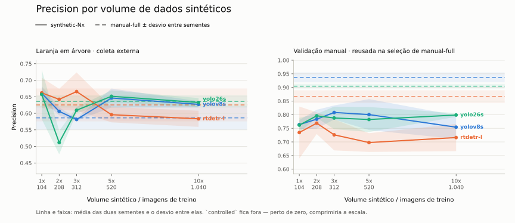
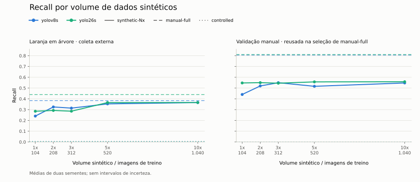
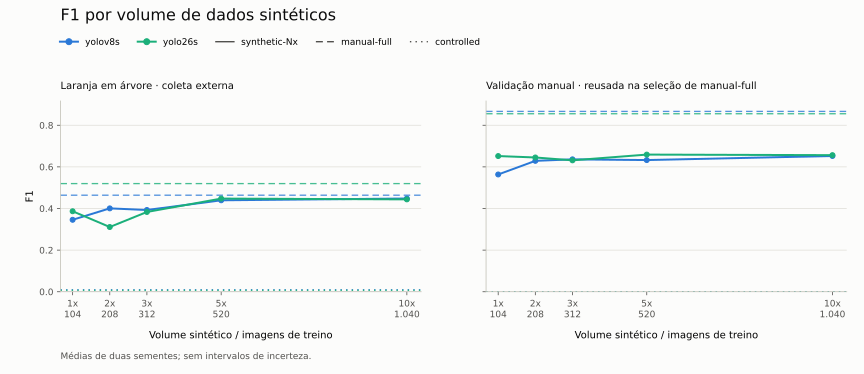
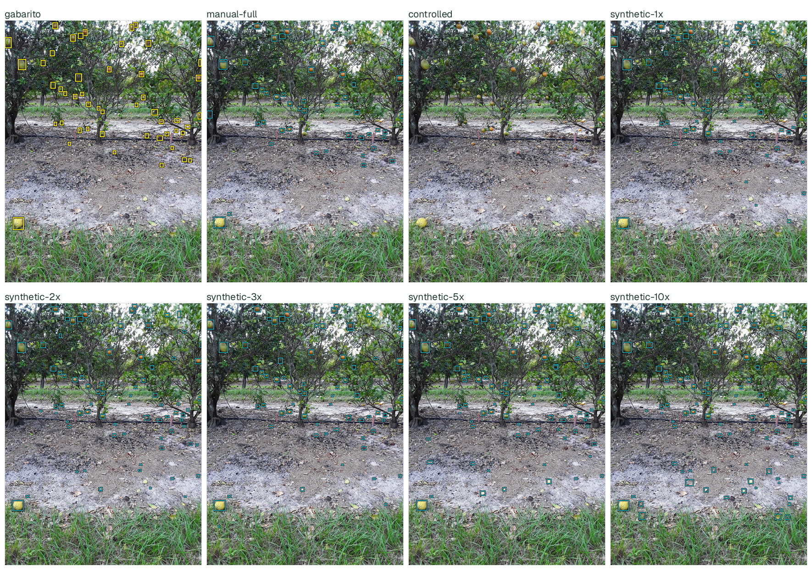
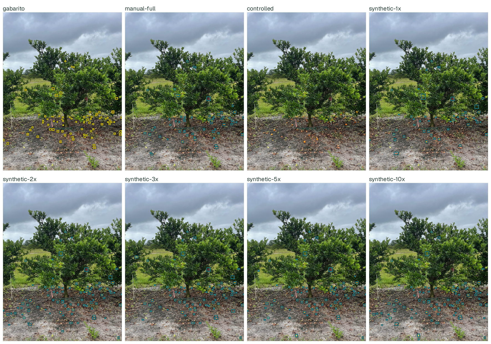
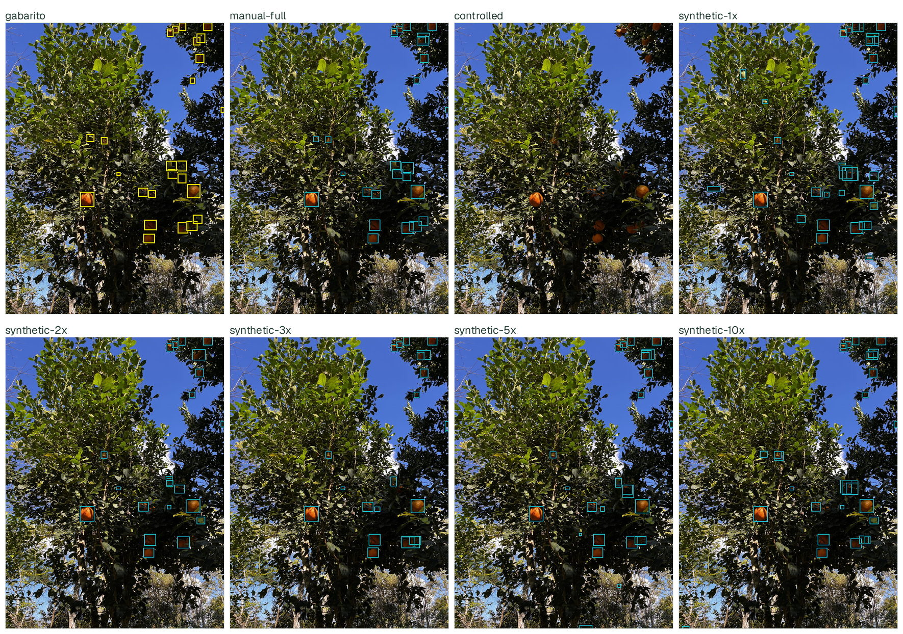
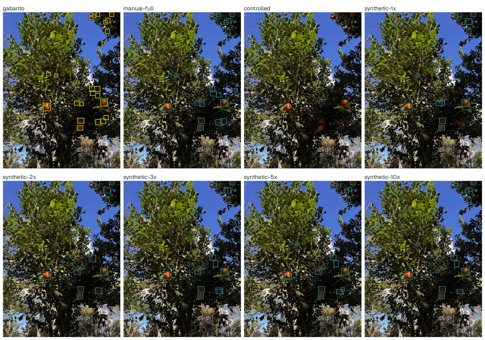
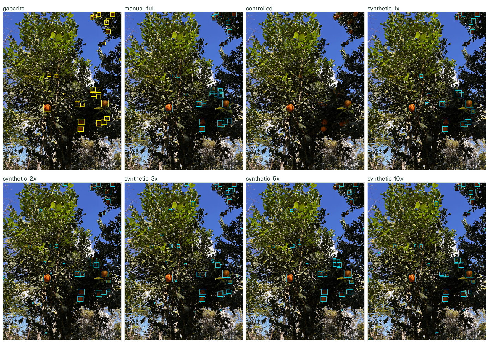
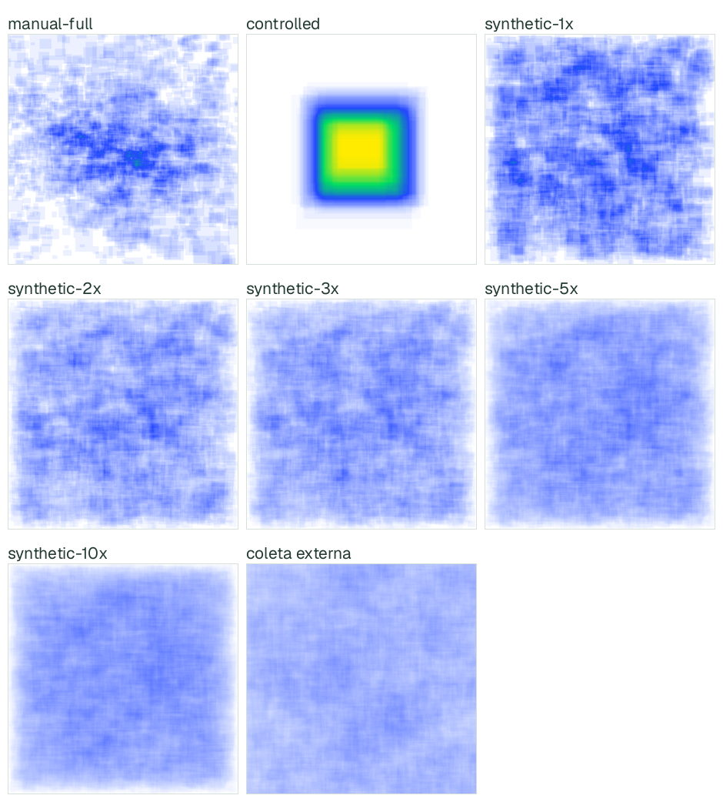

# Resultados dos detectores e exemplos de dados

Consolida 7 condições × 3 detectores × 2 sementes, num total de 42
treinamentos, com o protocolo de
[`configs/confirmatory.yaml`](../configs/confirmatory.yaml). Todas as 42
execuções compartilham o mesmo protocolo: 50 épocas, `imgsz` 960, `batch` 8,
`freeze: 5`, `mosaic` 1.0 com `close_mosaic` 5 e as mesmas augmentações de cor.
Nenhum hiperparâmetro varia por condição ou por detector.

A análise é exploratória: o desenvolvimento do gerador usou estatísticas dos
conjuntos avaliados, de modo que o CitDet não é um teste intocado.

| Conjunto de avaliação | Composição | Papel e limite |
|---|---|---|
| CitDet | 119 imagens e 10.082 caixas do split oficial de teste do [CitDet](https://robotic-vision-lab.github.io/citdet/) | Coleta externa. Suas estatísticas orientaram ajustes de escala e densidade do gerador; portanto, não é um teste intocado pelo desenvolvimento. |
| `manual_full_val` | 26 imagens e 451 caixas da validação de `manual-full` | Avaliação local. Essas imagens selecionaram os checkpoints de `manual-full`, por isso essa condição não tem uma estimativa independente neste conjunto. |

As tabelas mostram médias das sementes 41 e 42. As médias arredondadas não
permitem calcular intervalos de confiança nem testar equivalência. A magnitude
do viés de seleção em `manual_full_val` não foi estimada. A diferença de coleta
e a seleção de checkpoints impedem atribuir as diferenças a uma única causa.

## Como reproduzir

Além do fluxo padrão do [`README.md`](../README.md#execução), os dois conjuntos
de avaliação foram registrados em `external_datasets` de
[`configs/pipeline.yaml`](../configs/pipeline.yaml) (`citdet`, já documentado no
README, e `manual_full_val`, que aponta para o próprio split de validação do
`manual-full`) e avaliados sem retreinar nada:

```bash
./run_pipeline.sh test --device 0 --unlock-test --external-name citdet
./run_pipeline.sh test --device 0 --unlock-test --external-name manual_full_val
./run_pipeline.sh report --external-name citdet
./run_pipeline.sh report --external-name manual_full_val
.venv/bin/python scripts/plot_confirmatory_results.py
```

Por padrão, o último comando reproduz o gráfico a partir das médias
arredondadas versionadas em [`results-summary.json`](results-summary.json),
transcritas das tabelas desta página. Para usar os resultados locais com
precisão completa, execute:

```bash
.venv/bin/python scripts/plot_confirmatory_results.py --results-dir artifacts/confirmatory
```

Os JSONs por execução ficam fora do Git. O snapshot versionado não contém
observações por semente e não permite reconstruir sua dispersão.
Relatórios completos com curvas de treino e CSVs detalhados:
`artifacts/confirmatory/RESULTS_citdet.md` e `RESULTS_manual_full_val.md`.

### Baixar os pesos treinados (sem retreinar)

Os 42 checkpoints (`best.pt`) da fase confirmatória e o `model_selection.json`
correspondente estão publicados como asset de release, validados por
SHA-256 em [`configs/pipeline.yaml`](../configs/pipeline.yaml) (`confirmatory_checkpoints`).
Num computador novo, depois de preparar os dados (`./run_pipeline.sh prepare
--device 0 --accept-data-terms`, que só baixa/organiza dados, sem treinar):

```bash
.venv/bin/python scripts/download_weights.py
```

Isso baixa o ZIP, valida o hash, extrai cada checkpoint em
`runs/confirmatory/training/<run_id>/weights/best.pt` e escreve
`artifacts/confirmatory/model_selection.json` já com os caminhos corrigidos
para a máquina local (os caminhos originais são absolutos e específicos de
onde o treino rodou). A partir daí, `evaluate_test.py`, `generate_report.py` e
`scripts/plot_confirmatory_results.py` funcionam normalmente contra qualquer
teste externo novo, sem rodar `train`/`select`:

```bash
./run_pipeline.sh prepare-test --external-name <nome> --external-source <arquivo>
./run_pipeline.sh test --device 0 --unlock-test --external-name <nome>
./run_pipeline.sh report --external-name <nome>
```

Release: https://github.com/Kastango/synthetic-fruit-detection-dataset-generation/releases/tag/confirmatory-checkpoints

## Como mais dados sintéticos afetam o mAP


*Figura 1. Mesma escala vertical nos dois painéis, com origem em zero. Pontos e
linhas contínuas mostram médias dos volumes sintéticos; tracejados mostram
`manual-full` e pontilhados, `controlled`, para o mesmo detector. As linhas
conectam condições discretas e não constituem um ajuste de curva.*

`controlled` apresenta mAP entre 0,000 e 0,004 no CitDet, indicando ausência
de transferência nas condições avaliadas. Esses mesmos treinos alcançam entre
0,93 e 0,99 de mAP@.50:.95 na sua própria validação, então o valor externo
mede distância de domínio, não falha de otimização.

A resposta ao volume difere por detector. No RT-DETR-L o crescimento é quase
monotônico e é o maior de todos: 0,152, 0,196, 0,188, 0,209 e 0,217 de `1x` a
`10x`. No YOLOv8s a subida é suave e o máximo fica em `10x` (0,228). No YOLO26s
o máximo ocorre em `3x` (0,243) e os volumes seguintes recuam para 0,236 e
0,239. Cinco pontos não estabelecem uma curva de saturação, e a oscilação do
YOLO26s tem a mesma ordem de grandeza da dispersão entre sementes.

No CitDet, o melhor volume sintético supera a média de `manual-full` em 0,013
no YOLOv8s, 0,069 no RT-DETR-L e 0,002 no YOLO26s. Os dois primeiros são
maiores que a dispersão observada entre sementes; o terceiro não é, e a
leitura honesta para o YOLO26s é paridade, não ganho. A escolha do máximo
entre cinco volumes é posterior à avaliação e não demonstra que toda condição
sintética supere a referência. Vale notar que no YOLOv8s e no RT-DETR-L todos
os cinco volumes sintéticos ficam acima de `manual-full`, o que não depende
dessa escolha posterior.

Em `manual_full_val` a ordem se inverte e `manual-full` tem as maiores médias
nos três detectores, com folga de 0,11 a 0,12 nos YOLOs. Esse conjunto também
foi usado na seleção dos checkpoints, então parte da vantagem é viés de
seleção — mas a direção do resultado é consistente com a expectativa de que
treino no domínio vença dentro do domínio. A afirmação que estes dados
sustentam é sobre transferência para coleta externa, não sobre superioridade
geral do dado sintético.

## Precision, recall e F1 por volume sintético







Os três gráficos seguem a convenção do mAP: médias das sementes 41 e 42,
uma cor por detector, curvas sintéticas contínuas e referências `manual-full`
tracejadas e `controlled` pontilhadas. Cada métrica compartilha a escala entre
os dois conjuntos. F1 é a média registrada pelo avaliador, não a média
harmônica calculada a partir de precision e recall já arredondados.

## Tabela completa

**Congelamento uniforme.** As 42 execuções usam `freeze: 5`, que congela os
blocos 0–4 do backbone — do stem até a saída de stride 8 — e coloca suas
estatísticas de BatchNorm em modo de avaliação. São 320.160 parâmetros em
YOLOv8s (2,9% do detector) e 296.640 em YOLO26s (3,0%), o mesmo trecho
arquitetural nos dois. A decisão foi tomada depois de medir que o
congelamento favorece o treino sintético e prejudica o treino real: em
YOLOv8s com quatro sementes, `manual-full` cai de 0,5459 para 0,5062 no
conjunto local, enquanto no CitDet fica estável (0,2126 para 0,2130). Mantê-lo
uniforme custa cerca de 0,04 de mAP local à linha de base real. A alternativa
— congelar só o sintético — tornaria as colunas incomparáveis, trocando um
custo declarado por um viés silencioso. O custo fica registrado aqui para que
a leitura das linhas `manual-full` já o incorpore.

`[val]` identifica checkpoints selecionados nas mesmas 26 imagens em que a
linha é avaliada. O destaque em negrito marca apenas a maior média observada
por detector e conjunto, sem teste de significância. P, R e F1 vêm do avaliador;
o limiar `conf=0.25` indicado nos exemplos abaixo não define o cálculo de AP.
MAE é o erro absoluto médio de contagem por imagem, não uma medida de safra.
A contagem usa o limiar de maior F1 da validação de origem de cada execução,
registrado na seleção, com fallback de 0,25 se o valor não estiver disponível.
O traço na coluna MAE de `controlled`/yolov8s marca uma célula sem medida
interpretável: as duas sementes colapsam de formas opostas — uma tem F1 máximo
zero, o que leva o limiar a 0,0 e faz cada imagem emitir as 1000 caixas de
`max_det`, e a outra recebe limiar 0,95 e não emite nenhuma. A média das duas
seria um número sem significado. O mAP dessa célula continua medido e é 0,000.

### CitDet, coleta externa usada na calibração

| Detector | Condição | P | R | F1 | mAP@.50 | mAP@.75 | mAP@.50:.95 | Count MAE |
|---|---|---:|---:|---:|---:|---:|---:|---:|
| yolov8s | manual-full | 0.715 | 0.464 | 0.563 | 0.511 | 0.135 | 0.215 | 48.1 |
| yolov8s | controlled | 0.000 | 0.000 | 0.000 | 0.000 | 0.000 | 0.000 | — |
| yolov8s | synthetic-1x | 0.728 | 0.480 | 0.578 | 0.536 | 0.137 | 0.222 | 27.4 |
| yolov8s | synthetic-2x | 0.704 | 0.512 | 0.593 | 0.553 | 0.125 | 0.223 | 27.5 |
| yolov8s | synthetic-3x | 0.719 | 0.488 | 0.581 | 0.542 | 0.135 | 0.223 | 27.6 |
| yolov8s | synthetic-5x | 0.729 | 0.495 | 0.589 | 0.552 | 0.131 | 0.225 | 27.7 |
| yolov8s | **synthetic-10x** | 0.697 | 0.498 | 0.581 | 0.546 | 0.143 | **0.228** | 23.1 |
| rtdetr-l | manual-full | 0.505 | 0.494 | 0.495 | 0.373 | 0.074 | 0.147 | 41.2 |
| rtdetr-l | controlled | 0.009 | 0.020 | 0.012 | 0.005 | 0.005 | 0.004 | 84.7 |
| rtdetr-l | synthetic-1x | 0.469 | 0.432 | 0.449 | 0.397 | 0.079 | 0.152 | 51.9 |
| rtdetr-l | synthetic-2x | 0.632 | 0.504 | 0.560 | 0.517 | 0.095 | 0.196 | 35.1 |
| rtdetr-l | synthetic-3x | 0.646 | 0.483 | 0.552 | 0.502 | 0.090 | 0.188 | 38.8 |
| rtdetr-l | synthetic-5x | 0.671 | 0.522 | 0.587 | 0.536 | 0.107 | 0.209 | 27.9 |
| rtdetr-l | **synthetic-10x** | 0.701 | 0.523 | 0.599 | 0.554 | 0.113 | **0.217** | 25.3 |
| yolo26s | manual-full | 0.755 | 0.522 | 0.617 | 0.578 | 0.141 | 0.241 | 42.4 |
| yolo26s | controlled | 0.500 | 0.000 | 0.000 | 0.003 | 0.000 | 0.001 | 84.7 |
| yolo26s | synthetic-1x | 0.714 | 0.514 | 0.598 | 0.568 | 0.134 | 0.230 | 24.9 |
| yolo26s | synthetic-2x | 0.725 | 0.530 | 0.612 | 0.584 | 0.138 | 0.237 | 24.6 |
| yolo26s | **synthetic-3x** | 0.726 | 0.534 | 0.615 | 0.587 | 0.148 | **0.243** | 24.8 |
| yolo26s | synthetic-5x | 0.725 | 0.532 | 0.613 | 0.582 | 0.140 | 0.236 | 22.1 |
| yolo26s | synthetic-10x | 0.700 | 0.536 | 0.607 | 0.577 | 0.142 | 0.239 | 20.9 |

Negrito = maior média de mAP@.50:.95 entre as condições desse detector.

### Validação manual, avaliação local com reuso para seleção

| Detector | Condição | P | R | F1 | mAP@.50 | mAP@.75 | mAP@.50:.95 | Count MAE |
|---|---|---:|---:|---:|---:|---:|---:|---:|
| yolov8s | **manual-full** [val] | 0.923 | 0.768 | 0.838 | 0.855 | 0.562 | **0.511** | 3.1 |
| yolov8s | controlled | 0.000 | 0.000 | 0.000 | 0.000 | 0.000 | 0.000 | — |
| yolov8s | synthetic-1x | 0.814 | 0.572 | 0.672 | 0.653 | 0.422 | 0.380 | 3.6 |
| yolov8s | synthetic-2x | 0.801 | 0.577 | 0.671 | 0.642 | 0.424 | 0.375 | 3.2 |
| yolov8s | synthetic-3x | 0.808 | 0.569 | 0.667 | 0.650 | 0.418 | 0.380 | 2.8 |
| yolov8s | synthetic-5x | 0.831 | 0.587 | 0.688 | 0.667 | 0.427 | 0.390 | 3.6 |
| yolov8s | synthetic-10x | 0.817 | 0.613 | 0.700 | 0.682 | 0.438 | 0.397 | 3.8 |
| rtdetr-l | **manual-full** [val] | 0.630 | 0.711 | 0.658 | 0.655 | 0.423 | **0.388** | 5.0 |
| rtdetr-l | controlled | 0.002 | 0.022 | 0.004 | 0.000 | 0.000 | 0.000 | 17.3 |
| rtdetr-l | synthetic-1x | 0.740 | 0.488 | 0.584 | 0.527 | 0.321 | 0.302 | 5.2 |
| rtdetr-l | synthetic-2x | 0.735 | 0.561 | 0.636 | 0.618 | 0.368 | 0.346 | 4.1 |
| rtdetr-l | synthetic-3x | 0.708 | 0.570 | 0.631 | 0.612 | 0.354 | 0.341 | 3.9 |
| rtdetr-l | synthetic-5x | 0.711 | 0.534 | 0.609 | 0.593 | 0.352 | 0.336 | 4.4 |
| rtdetr-l | synthetic-10x | 0.759 | 0.523 | 0.618 | 0.599 | 0.358 | 0.342 | 4.9 |
| yolo26s | **manual-full** [val] | 0.885 | 0.770 | 0.822 | 0.855 | 0.567 | **0.511** | 3.2 |
| yolo26s | controlled | 0.333 | 0.002 | 0.004 | 0.003 | 0.003 | 0.002 | 17.3 |
| yolo26s | synthetic-1x | 0.802 | 0.598 | 0.684 | 0.661 | 0.409 | 0.375 | 3.0 |
| yolo26s | synthetic-2x | 0.805 | 0.606 | 0.691 | 0.658 | 0.408 | 0.376 | 3.2 |
| yolo26s | synthetic-3x | 0.774 | 0.604 | 0.679 | 0.656 | 0.415 | 0.382 | 2.9 |
| yolo26s | synthetic-5x | 0.790 | 0.588 | 0.674 | 0.659 | 0.420 | 0.380 | 3.3 |
| yolo26s | synthetic-10x | 0.799 | 0.594 | 0.682 | 0.665 | 0.428 | 0.388 | 3.1 |

Negrito = maior média de mAP@.50:.95 entre as condições desse detector.

## Exemplos de detecção

O gabarito usa caixas amarelas de 5 pixels com contorno preto, desenhadas
depois do redimensionamento para manter a legibilidade. As predições aparecem
em ciano. As coordenadas das anotações permanecem as originais.

### CitDet

Duas cenas do split de teste do CitDet, cada uma avaliada com o checkpoint
`yolo26s` (semente 41) de todas as sete condições, `conf ≥ 0.25`. As duas
cobrem regimes de densidade opostos, e a segunda foi escolhida por regra
explícita: a imagem cuja contagem de caixas é a mais próxima da mediana do
conjunto (78), com desempate lexicográfico. A escolha não usou predições de
detector. Cada folha abre em tamanho cheio ao clicar.

**Cena esparsa** — `ftp-6-60-43_fruit-drop-back-picture_1_2021-11-09-01-57-07`,
49 caixas de gabarito, no percentil 33 do CitDet.

[](figures/results/sheets/citdet-cena-esparsa.jpg)

**Cena na mediana** — `bingo_plot23_plant1_treefront`, 78 caixas de gabarito,
exatamente a mediana do conjunto, e de outra subcoleção do CitDet.

[](figures/results/sheets/citdet-cena-mediana.jpg)

Na cena mediana, o gabarito tem 78 caixas; `manual-full` prevê 61,
`synthetic-3x` prevê 77 e `synthetic-10x` prevê 91. `controlled` não produz
nenhuma detecção em nenhuma das duas cenas, coerente com seu mAP de 0,001.
São duas imagens ilustrativas, não uma amostra aleatória: elas mostram o tipo
de erro cometido, não a distribuição de erros do conjunto.

### manual-full.val

Imagem `img_2021.jpg`, com **25 caixas de gabarito**, primeira em ordem
lexicográfica no split de validação. A seleção independe das predições.
Os três detectores usam os checkpoints da semente 41, `conf=0.25`,
`imgsz=960` e `max_det=1000`. Esta cena ilustra diferenças de detecção;
contagens iguais não significam caixas corretas nem desempenho equivalente.

As três folhas abaixo mostram, para cada detector, o gabarito e as sete
condições na mesma cena.

**YOLOv8s**

[](figures/results/sheets/manual-full-val-yolov8s.jpg)

**YOLO26s**

[](figures/results/sheets/manual-full-val-yolo26s.jpg)

**RT-DETR-L**

[](figures/results/sheets/manual-full-val-rtdetr-l.jpg)

Reprodução, sem novos treinos:

```bash
.venv/bin/python scripts/render_detection_examples.py
.venv/bin/python scripts/render_detection_examples.py \
  --image-stem bingo_plot23_plant1_treefront_jpeg --output-name cena-mediana
for model in yolov8s yolo26s rtdetr-l; do
  .venv/bin/python scripts/render_detection_examples.py \
    --dataset manual_full_val --model "$model"
done
.venv/bin/python scripts/build_example_sheets.py
```

O último comando monta as folhas de contato publicadas nesta página a partir
das imagens individuais. Use `--image-stem`, `--output-name` e `--seed` para
render­izar outra cena ou semente.
Os arquivos `provenance.json` junto das imagens registram hashes dos dados,
checkpoints, condições e contagens. O script verifica o hash de cada peso
contra a seleção congelada antes da inferência.

## Exemplos de dados sintéticos

Cenas de `synthetic-3x`, o mesmo subconjunto usado nos treinamentos acima,
geradas com semente raiz 42 e amostragem pareada. A seleção usa os quantis
25%, 50%, 75% e 97% da contagem de caixas nas 390 cenas, com desempate pelo
índice de geração; não usa resultados de detector nem seleção estética.
As cenas sem caixas permitem inspecionar problemas de inserção, escala e
iluminação que as métricas não resumem.

[](figures/results/sheets/cenas-sinteticas.jpg)

A folha alterna cena composta e gabarito automático, nos quantis 25%, 50%,
75% e 97% da contagem de caixas (11, 20, 30 e 104 frutas).

Reproduza a exportação com `.venv/bin/python scripts/render_synthetic_examples.py`.
O dataset deve estar gerado conforme o [guia do estúdio](GENERATOR_STUDIO.md).
O [registro de origem](figures/results/synthetic-examples/provenance.json)
preserva sementes por cena, hashes, índices e a regra de seleção.

## Distribuição espacial das anotações

Área das caixas acumulada em coordenadas normalizadas, média por imagem;
branco = ausência, azul→amarelo = densidade crescente. Escala de cor
compartilhada entre todos os conjuntos.

[](figures/results/sheets/mapas-de-anotacoes.jpg)

Os mapas somam a cobertura das caixas e dividem pelo número de imagens;
portanto, combinam posição, tamanho e quantidade de caixas. Não são mapas de
atenção do detector nem isolam a diversidade espacial. A concentração em
`controlled` é compatível com suas fotos de frutas isoladas, mas o mapa não
estabelece a causa do baixo desempenho. As figuras agregam treino e validação
nas condições de treinamento, conforme as contagens indicadas.

## O que os resultados permitem afirmar

1. A composição sintética apresentou maior transferência que `controlled`
   nas condições avaliadas. Essa comparação altera contexto, escala, densidade
   e quantidade de caixas ao mesmo tempo; não isola o efeito de DepthPro,
   sombras ou qualquer outra transformação.
2. No CitDet, o treino exclusivamente sintético igualou ou superou o treino
   com fotos reais anotadas à mão nos três detectores, sob protocolo idêntico.
   A margem é de 0,013 no YOLOv8s e 0,069 no RT-DETR-L; no YOLO26s é de 0,002,
   compatível com empate. A observação ainda precisa de confirmação em dados
   não usados no desenvolvimento e com a condição escolhida previamente.
3. A vantagem não se estende ao conjunto local, onde `manual-full` lidera nos
   três detectores. As duas leituras juntas descrevem um efeito de domínio:
   o dado sintético cobre melhor a distribuição da coleta externa, e o dado
   real cobre melhor a sua própria.
4. A resposta ao volume depende do detector e dos hiperparâmetros usados.
   Mais imagens implicam mais passos por época e maior validação. Não se pode
   atribuir as diferenças apenas à arquitetura ou à diversidade sintética.
5. As menores médias de MAE de contagem no CitDet foram 20,9 para YOLO26s em
   `10x`, 23,1 para YOLOv8s em `10x` e 25,3 para RT-DETR-L em `10x`. Os
   valores de `manual-full` foram 42,4, 48,1 e 41,2. Todas as condições
   sintéticas de YOLOv8s e YOLO26s ficam abaixo da respectiva referência real.
   Contagem por imagem não mede produção por árvore ou pomar, nem corrige
   frutos ocultos ou repetidos em diferentes vistas.

Para uma etapa confirmatória, é necessário congelar gerador, condições e
critério de seleção antes de acessar um novo conjunto reservado. A análise
precisa incluir variabilidade por semente e, quando possível, incerteza por
unidade de coleta, como árvore ou sessão, em vez de tratar fotos correlacionadas
como amostras independentes. Economia de anotação requer registrar horas de
coleta, preparação e revisão dos rótulos automáticos.

## Rastreabilidade

- SHA-256 da seleção de checkpoints: `7709908f7ec327466623f1082952a585d6cdee83bc040e7a9f0931d845bb0c51`
- Checkpoints avaliados por teste: 42 (todos os treinamentos confirmatórios)
- O bloqueio da avaliação após `model_selection.json` não desfaz o uso prévio
  de estatísticas no gerador nem o reuso da validação manual para seleção.
- As médias versionadas registram a precisão das tabelas publicadas; auditoria
  por execução depende dos JSONs originais e dos manifestos do pool utilizado.

