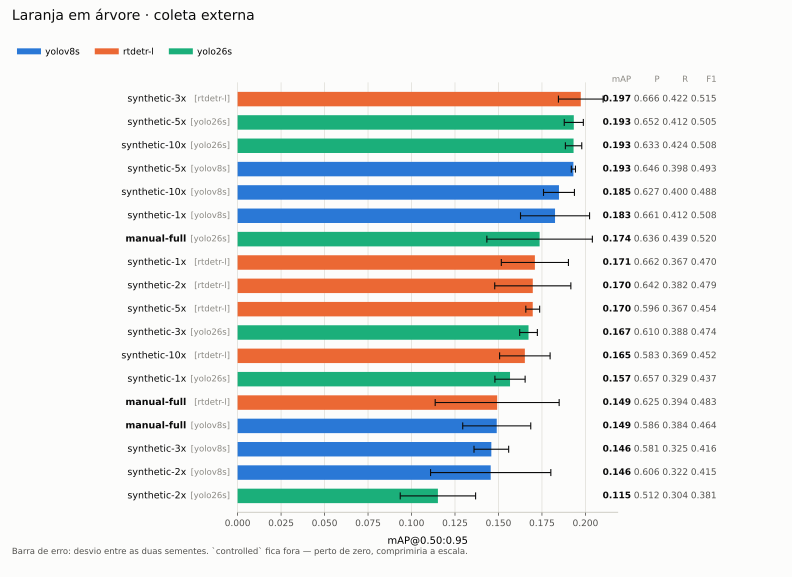
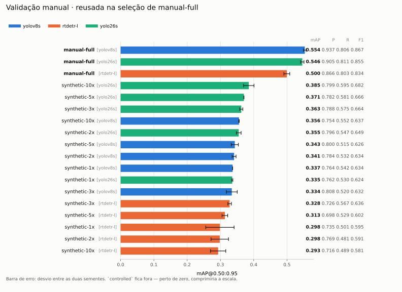
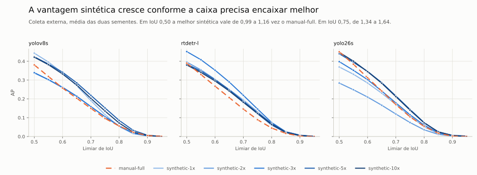
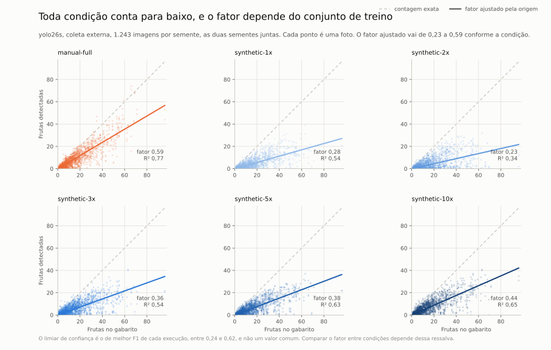
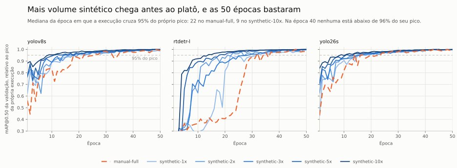
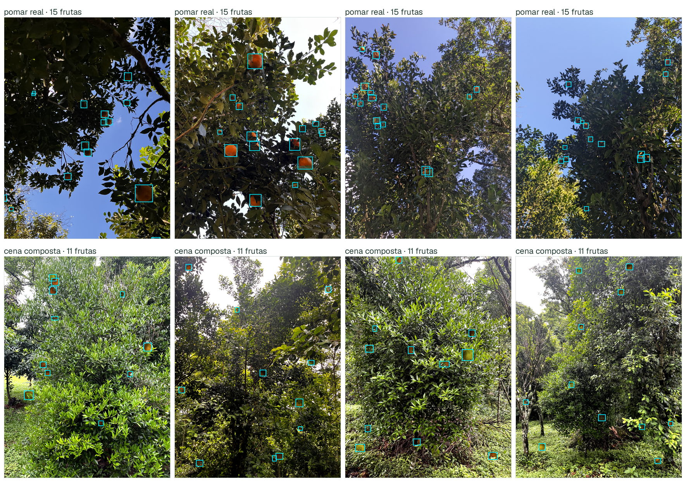
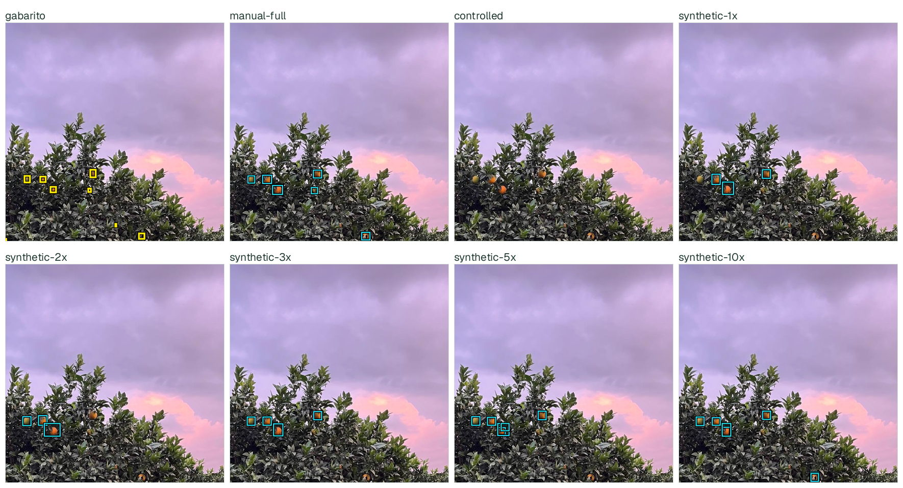
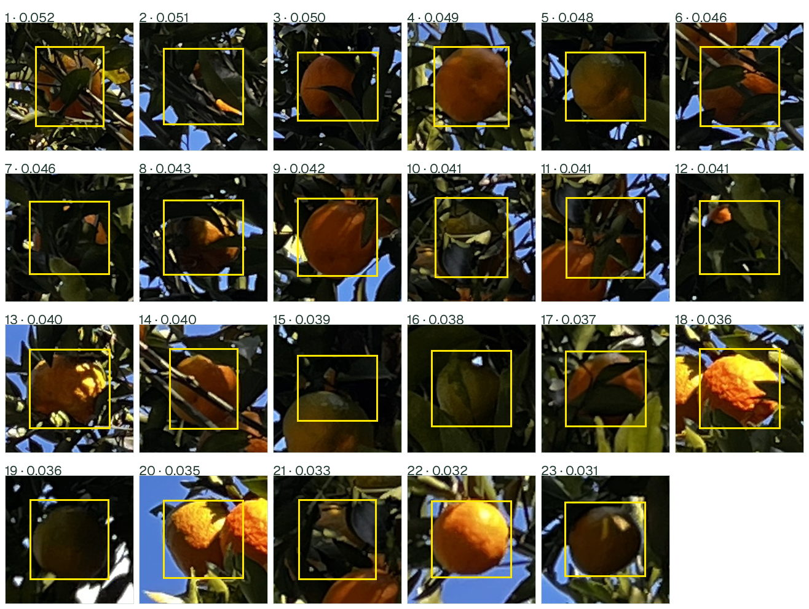

# Resultados

O experimento pergunta se cena composta por computador substitui foto anotada à
mão no treino de um detector de poncã. Sete condições de treino, três
arquiteturas e duas sementes fecham 42 execuções de 50 épocas em 960 px. Nenhuma
camada fica congelada.

A avaliação usa dois conjuntos com papéis distintos. `oranges_field` é coleta
externa: outro país, outra espécie de citro, outros sete celulares, nove
condições de luz e um protocolo de anotação escrito por terceiros.
`manual_full_val` são as 26 fotos de validação da coleta própria, do mesmo
pomar, dos mesmos tipos de dispositivo e do mesmo anotador usados no treino
de `manual-full`. A
condição `manual-full` também usa essas 26 fotos para escolher checkpoint. O
primeiro conjunto mede transferência. O segundo mede desempenho dentro do
domínio de origem, e favorece `manual-full` por construção.

## Procedência

| Item | Valor |
|---|---|
| Pool sintético | `config_hash 65ab60add0904ccc5336fb59`, manifesto `96f19445076b69a3` |
| Catálogo de ativos | `f3ad9117f88b460eeb98fb7c`, 228 fundos e 127 recortes |
| Manifesto `oranges_field` | `414470445dc9ce46` |
| Manifesto `manual_full_val` | `2be936523453bf5b` |
| Seleção | `91d49504703da8ce`, 21 candidatos, 42 execuções |
| Ultralytics | 8.4.121 |

A seleção olhou apenas para a validação de origem de cada condição. O teste foi
aberto depois dela, nos dois conjuntos. Cada condição carrega a própria
impressão de manifesto, então mudar um rótulo muda o identificador da execução.
Uma execução cujo identificador deixa de casar com o plano é refeita.

## Coleta externa: o melhor volume sintético supera manual-full em mAP



| Detector | Condição | P | R | F1 | mAP@.50 | mAP@.75 | mAP@.50:.95 | MAE cont. |
|---|---|---:|---:|---:|---:|---:|---:|---:|
| yolov8s | manual-full | 0.586 | 0.384 | 0.464 | 0.381 | 0.096 | 0.149 | 5.9 |
| yolov8s | controlled | 0.052 | 0.005 | 0.009 | 0.003 | 0.002 | 0.002 | 500.0 |
| yolov8s | synthetic-1x | 0.661 | 0.412 | 0.508 | 0.443 | 0.116 | 0.183 | 7.8 |
| yolov8s | synthetic-2x | 0.606 | 0.322 | 0.415 | 0.338 | 0.105 | 0.146 | 9.3 |
| yolov8s | synthetic-3x | 0.581 | 0.325 | 0.416 | 0.339 | 0.105 | 0.146 | 9.0 |
| yolov8s | **synthetic-5x** | 0.646 | 0.398 | 0.493 | 0.424 | 0.152 | **0.193** | 8.0 |
| yolov8s | synthetic-10x | 0.627 | 0.400 | 0.488 | 0.422 | 0.135 | 0.185 | 7.4 |
| rtdetr-l | manual-full | 0.625 | 0.394 | 0.483 | 0.390 | 0.089 | 0.149 | 6.3 |
| rtdetr-l | controlled | 0.073 | 0.010 | 0.018 | 0.008 | 0.005 | 0.005 | 12.8 |
| rtdetr-l | synthetic-1x | 0.662 | 0.367 | 0.470 | 0.385 | 0.132 | 0.171 | 7.6 |
| rtdetr-l | synthetic-2x | 0.642 | 0.382 | 0.479 | 0.396 | 0.122 | 0.170 | 7.9 |
| rtdetr-l | **synthetic-3x** | 0.666 | 0.422 | 0.515 | 0.451 | 0.146 | **0.197** | 7.4 |
| rtdetr-l | synthetic-5x | 0.596 | 0.367 | 0.454 | 0.384 | 0.127 | 0.170 | 9.9 |
| rtdetr-l | synthetic-10x | 0.583 | 0.369 | 0.452 | 0.380 | 0.122 | 0.165 | 9.9 |
| yolo26s | manual-full | 0.636 | 0.439 | 0.520 | 0.450 | 0.105 | 0.174 | 5.7 |
| yolo26s | controlled | 0.115 | 0.004 | 0.007 | 0.005 | 0.004 | 0.004 | 12.8 |
| yolo26s | synthetic-1x | 0.657 | 0.329 | 0.437 | 0.369 | 0.109 | 0.157 | 9.1 |
| yolo26s | synthetic-2x | 0.512 | 0.304 | 0.381 | 0.284 | 0.074 | 0.115 | 9.7 |
| yolo26s | synthetic-3x | 0.610 | 0.388 | 0.474 | 0.398 | 0.116 | 0.167 | 7.9 |
| yolo26s | **synthetic-5x** | 0.652 | 0.412 | 0.505 | 0.440 | 0.144 | **0.193** | 7.8 |
| yolo26s | synthetic-10x | 0.633 | 0.424 | 0.508 | 0.448 | 0.140 | 0.193 | 7.0 |

P é precision. R é recall. As métricas são médias das duas sementes. P e R
usam o ponto selecionado pelo avaliador em cada avaliação, e não um limiar
comum entre modelos. MAE cont. é o erro absoluto médio de contagem.
Negrito marca a maior média observada, sem indicar significância estatística.

## Validação da coleta própria: manual-full tem o maior mAP



| Detector | Condição | P | R | F1 | mAP@.50 | mAP@.75 | mAP@.50:.95 | MAE cont. |
|---|---|---:|---:|---:|---:|---:|---:|---:|
| yolov8s | **manual-full** [val] | 0.937 | 0.806 | 0.867 | 0.902 | 0.615 | **0.554** | 2.7 |
| yolov8s | controlled | 0.000 | 0.000 | 0.000 | 0.000 | 0.000 | 0.000 | 500.0 |
| yolov8s | synthetic-1x | 0.764 | 0.542 | 0.634 | 0.603 | 0.345 | 0.337 | 8.6 |
| yolov8s | synthetic-2x | 0.784 | 0.532 | 0.634 | 0.609 | 0.335 | 0.341 | 8.5 |
| yolov8s | synthetic-3x | 0.808 | 0.520 | 0.632 | 0.601 | 0.343 | 0.334 | 8.8 |
| yolov8s | synthetic-5x | 0.800 | 0.515 | 0.626 | 0.602 | 0.353 | 0.343 | 8.9 |
| yolov8s | synthetic-10x | 0.754 | 0.552 | 0.637 | 0.629 | 0.360 | 0.356 | 8.2 |
| rtdetr-l | **manual-full** [val] | 0.866 | 0.803 | 0.834 | 0.841 | 0.547 | **0.500** | 2.5 |
| rtdetr-l | controlled | 0.047 | 0.005 | 0.004 | 0.003 | 0.003 | 0.002 | 17.8 |
| rtdetr-l | synthetic-1x | 0.735 | 0.501 | 0.595 | 0.563 | 0.296 | 0.298 | 7.3 |
| rtdetr-l | synthetic-2x | 0.769 | 0.481 | 0.591 | 0.546 | 0.305 | 0.298 | 7.9 |
| rtdetr-l | synthetic-3x | 0.726 | 0.567 | 0.636 | 0.609 | 0.329 | 0.328 | 7.4 |
| rtdetr-l | synthetic-5x | 0.698 | 0.529 | 0.602 | 0.570 | 0.313 | 0.313 | 9.4 |
| rtdetr-l | synthetic-10x | 0.716 | 0.489 | 0.581 | 0.542 | 0.291 | 0.293 | 9.2 |
| yolo26s | **manual-full** [val] | 0.905 | 0.811 | 0.855 | 0.890 | 0.611 | **0.546** | 2.5 |
| yolo26s | controlled | 0.000 | 0.000 | 0.000 | 0.000 | 0.000 | 0.000 | 17.8 |
| yolo26s | synthetic-1x | 0.762 | 0.530 | 0.624 | 0.603 | 0.346 | 0.335 | 9.0 |
| yolo26s | synthetic-2x | 0.796 | 0.547 | 0.649 | 0.622 | 0.365 | 0.355 | 8.8 |
| yolo26s | synthetic-3x | 0.788 | 0.575 | 0.664 | 0.647 | 0.370 | 0.363 | 7.1 |
| yolo26s | synthetic-5x | 0.782 | 0.581 | 0.666 | 0.651 | 0.383 | 0.371 | 7.4 |
| yolo26s | synthetic-10x | 0.799 | 0.595 | 0.682 | 0.674 | 0.404 | 0.385 | 6.8 |

`[val]` marca a condição que usou este mesmo conjunto para escolher checkpoint.

## Curvas por volume


Cada painel tem escala própria. As duas avaliações vivem em faixas diferentes de
mAP, e um eixo comum esconderia a forma das curvas. A faixa tracejada é
`manual-full` com o desvio entre suas duas sementes. A faixa colorida é o mesmo
desvio para cada curva sintética. `controlled` não aparece aqui, porque um valor
perto de zero achataria as curvas contra o topo. Nos rankings acima, onde cada
condição ocupa uma linha, `controlled` está.


As mesmas curvas para
[precision](figures/results/synthetic-volume-vs-precision.svg) e
[recall](figures/results/synthetic-volume-vs-recall.svg) mostram de onde vem o
F1. O efeito do volume depende da arquitetura e do conjunto. Por exemplo,
na validação própria o recall do YOLO26s aumenta de 0,530 em 1x para 0,595
em 10x. Na coleta externa a relação não é monotônica.

## O que os números dizem

**Na coleta externa, o melhor volume sintético tem mAP maior que `manual-full`
nas três arquiteturas.** O melhor volume sintético abre 0,044 de mAP@.50:.95 sobre
`manual-full` no YOLOv8s, com 0,193 contra 0,149. No RT-DETR-L abre 0,048, com
0,197 contra 0,149. No YOLO26s abre 0,020, com 0,193 contra 0,174. Os volumes com maior média usam 520 imagens de treino nos YOLOs e 312 no
RT-DETR-L. `manual-full` usa 104 fotos. O resultado compara também diferentes
quantidades de dados e passos de otimização. Ele não isola o efeito da origem
sintética das imagens.

**Nesta avaliação, a vantagem de `manual-full` aparece na coleta própria.** Na validação da
coleta própria o quadro inverte, e por margem maior. `manual-full` abre 0,198
sobre a melhor sintética no YOLOv8s, 0,172 no RT-DETR-L e 0,161 no YOLO26s. As
duas leituras não se contradizem. Uma mede o domínio de origem, a outra mede o
que sai dele.

**As maiores médias externas aparecem em 3x ou 5x.** De 1x ao pico, o ganho externo é
0,010 no YOLOv8s em 5x, 0,026 no RT-DETR-L em 3x e 0,036 no YOLO26s em 5x. De 5x
para 10x o saldo é −0,008, −0,005 e 0,000. Nesta rodada, dobrar de 520 para 1.040 imagens de treino não melhorou a média
externa. Isso não demonstra um limite geral de volume, nem mede a relação
entre custo de geração e benefício.

**A condição `controlled` tem desempenho próximo de zero.**
`controlled` treina em fruta fotografada em ambiente controlado, com caixa vinda
da máscara de segmentação e sem composição em copa. O resultado fica entre 0,002
e 0,005 de mAP externo, e entre 0,000 e 0,002 na validação própria. No YOLOv8s o
viés de contagem chega a 487 caixas por imagem, com precisão 0,05, e muitas previsões incorretas. O resultado favorece o uso de cenas compostas
em relação a este controle, mas não isola qual parte do compositor ajuda.

**Todas as condições subestimam a contagem na coleta externa.** As sintéticas
erram de −6,8 a −9,9 frutas por imagem. `manual-full` erra de −5,5 a −6,1. O
mesmo déficit aparece como recall mais baixo.

## Diagnósticos

As tabelas resumem cada execução num número por métrica. As três leituras abaixo
usam os dados por imagem e por época, que já saem do pipeline em
`artifacts/confirmatory/analysis_csv/`. Nenhuma delas precisa de inferência nova.

### A vantagem sintética aparece quando a caixa precisa encaixar melhor



O mAP@0.50:0.95 é a média de dez limiares de IoU. Separados, eles mostram onde a
distância se forma. Em IoU 0,50, que aceita meia sobreposição, a melhor sintética
vale de 0,99 a 1,16 vez o `manual-full`. Em IoU 0,75 vale de 1,34 a 1,64. A razão
cresce a cada limiar, nas três arquiteturas. Os dois treinos encontram fruta em
quantidade parecida. O treino sintético entrega a caixa que concorda melhor com o
gabarito externo.

A origem do rótulo é uma explicação possível. A caixa sintética vem da máscara
visível do recorte, então ela é exata por construção. A caixa de `manual-full`
vem de arrasto humano sobre fruta parcialmente escondida. Estes números não
separam essa causa de outras.

### O fator de correção de contagem depende do conjunto de treino



Cada ponto é uma foto da coleta externa. A nuvem inteira fica abaixo da
diagonal, que marca a contagem exata. A reta colorida é o fator que melhor
ajusta aquela condição pela origem.

O fator vai de 0,23 em `synthetic-2x` a 0,59 em `manual-full`, e o R² acompanha,
de 0,34 a 0,77. Um fator único corrigiria a contagem de `manual-full` com erro
moderado. Não corrigiria a de `synthetic-2x`. O fator não transfere entre
conjuntos de treino, então ele precisa ser medido para o modelo que for entrar em
uso.

A proporção se mantém acima de cinco frutas por foto. Abaixo disso ela quebra em
todas as condições. Na faixa de uma a quatro frutas a razão mediana entre
previsto e real cai para 0,33 em `manual-full`, e para zero em `synthetic-1x` e
`synthetic-2x`. Foto de fruta esparsa é o pior caso da contagem.

Duas ressalvas limitam a leitura. O limiar de confiança é o de melhor F1 de cada
execução, entre 0,24 e 0,62, e não um valor comum entre condições. E o ajuste
mede a coleta externa, que é laranja doce.

### Mais volume sintético chega antes ao platô



Cada condição valida no próprio conjunto, com contagem de imagens diferente, então
os valores absolutos não se comparam entre curvas. O eixo mostra cada execução
relativa ao próprio pico, o que deixa uma pergunta só: quando o treino para de
subir?

A mediana da época em que a execução cruza 95% do próprio pico cai com o volume:
22 em `manual-full`, 19,5 em 1x, 18 em 2x, 17 em 3x, 11 em 5x e 9 em 10x. Uma
época de `synthetic-10x` tem dez vezes mais passos de otimização que uma de
`manual-full`, o que explica parte da diferença.

Na época 40 nenhuma execução está abaixo de 96% do próprio pico. As 50 épocas
bastaram para esta receita, e `patience: 30` nunca precisou disparar. O RT-DETR-L
é o mais lento dos três: com `manual-full` ele cruza os 95% na época 31,5, contra
22,0 no YOLOv8s e 15,0 no YOLO26s.

## Ponderações

**Os resultados sugerem diferenças de generalização.**
O melhor volume sintético supera `manual-full` em mAP na coleta externa,
mas perde na validação própria. A recombinação de fundos e recortes pode
contribuir para essa transferência. A tabela não mede cobertura visual nem
fidelidade, então não identifica a causa da diferença. Também não há vantagem
em todas as métricas: no YOLO26s externo, `manual-full` tem recall 0,439,
contra 0,412 de `synthetic-5x`, apesar do mAP menor.

**Ampliar o catálogo é uma hipótese a testar.** Em 1x, cada um
dos 127 recortes aparece 13,5 vezes em média. Em 10x, aparece 114,4 vezes. As
cenas novas acima de 5x reembaralham a mesma fruta sobre o mesmo fundo, sem melhorar a maior média externa desta rodada. A hipótese de limitação
pelo catálogo ainda não foi testada: para testá-la, o próximo
passo é ampliar o catálogo com o volume fixo, e não o volume com o catálogo
fixo.

**Oclusão e iluminação local merecem avaliação do anotador.**
A receita aceita instâncias com pelo menos 15% de superfície e 60 pixels
visíveis. Isso permite oclusão severa, mas não garante que sua frequência,
forma e iluminação correspondam às fotos reais. Os recortes abaixo ajudam
a revisar essa hipótese. Uma imagem escolhida por sua discrepância não
permite afirmar onde se concentra a perda de recall do conjunto inteiro.

**O viés de contagem é sistemático, e isso muda quem pode usar o detector.**
Nenhuma condição erra a contagem para cima na coleta externa. Todas erram para
baixo. O gráfico de contagem acima mostra que o erro é quase proporcional acima
de cinco frutas por foto, então um fator de correção tem forma. Só que o fator
muda com o conjunto de treino, de 0,23 a 0,59, e nenhuma dessas medidas foi
validada fora da coleta que a ajustou. Para estimar carga de árvore, meça o fator
do modelo que for entrar em uso, em dados separados.

**A comparação com `oranges_field` mede transferência, não acurácia na tarefa.**
Ela é laranja doce na Sicília. O destino do projeto é poncã em pomar
brasileiro. As estatísticas dela orientaram a calibração da receita, então
proximidade com ela não é evidência independente. Para uma conclusão
confirmatória seria preciso uma terceira coleta, intocada pelo desenvolvimento.

## Exemplos

Quatro fotos do pomar de poncã ao lado de quatro cenas compostas. As duas
metades trazem o gabarito desenhado e foram escolhidas pela densidade mediana de
cada coleção:



É esta comparação que a calibração de escala persegue. O centro de distância de
câmera por cena sai da distribuição de lado de caixa do pomar de poncã, e não da
coleta externa, que é laranja doce fotografada mais de perto.

Oito cenas diferentes, selecionadas por quantis de quantidade de caixas, com
o gabarito desenhado. Estes exemplos contêm de uma a 37 frutas:


Mesma cena, mesmo detector, uma coluna por condição de treino. A cena vem da
coleta externa e tem densidade mediana, com 8 frutas no gabarito:



`controlled` não devolve nada. As sintéticas sobem com o volume. `manual-full`
fecha as 8. A [cena densa](figures/results/sheets/externo-cena-densa.jpg), com
41 frutas, mostra o mesmo ordenamento.

### O pior caso para a receita sintética

Esta cena está entre as de maior diferença de acertos entre `manual-full` e as sintéticas.
A seleção compara YOLO26s, semente 41, nas 26 imagens, pela diferença entre
`manual-full` e a sintética com mais acertos em cada foto. É um caso extremo
nessa comparação, não um exemplo típico nem o pior caso de todas as arquiteturas. O desempate usa o nome da imagem. Em `img_2056`, são 23 frutas no gabarito.
Com confiança 0,25 e correspondência um a um a IoU 0,5, `manual-full` acerta
20 e a melhor sintética acerta 13. Cada painel
mostra as caixas que aquele detector devolveu:


No tamanho de página essas caixas não revelam o que há dentro. Ampliadas, sim.
Cada recorte abaixo traz uma fruta do gabarito, da maior para a menor. O número
depois do ponto é o lado maior da caixa dividido pelo menor lado da imagem:



Os recortes permitem conferir oclusão, iluminação e limites das caixas.
A comparação numérica não identifica qual desses fatores causa cada erro.
A revisão do anotador deve separar esses casos antes de orientar um novo treino.

A distribuição espacial das anotações de cada conjunto:


## Estabilidade e limites

São duas sementes por condição. Duas sementes servem para triagem, e não para
promover uma condição sobre outra. O desvio entre as duas, em mAP@.50:.95 na
coleta externa:

| Condição | YOLOv8s | RT-DETR-L | YOLO26s |
|---|---:|---:|---:|
| manual-full | 0.0196 | 0.0356 | 0.0303 |
| synthetic-1x | 0.0199 | 0.0193 | 0.0087 |
| synthetic-2x | 0.0346 | 0.0219 | 0.0217 |
| synthetic-3x | 0.0100 | 0.0129 | 0.0051 |
| synthetic-5x | 0.0012 | 0.0040 | 0.0055 |
| synthetic-10x | 0.0089 | 0.0145 | 0.0047 |

**Em 5x, o desvio observado entre as duas sementes é menor.**
Os desvios ficam entre 0,001 e 0,006 nas três arquiteturas. Duas repetições não
bastam para concluir que esse volume reduz a variância de forma consistente.
A tabela tampouco mede a variação entre sorteios independentes do gerador.

As diferenças médias não constituem um teste de significância. Comparar uma
diferença com o desvio de uma única condição também não estabelece superioridade.
Mais sementes, gerações independentes e outra coleta permitiriam verificar
se o resultado persiste. Escolher o melhor volume após olhar o teste torna
essa escolha exploratória.

## Auditoria do gabarito

A validação automática confere rótulos, contagens, identificadores congelados e
hashes de imagem e anotação contra o manifesto importado. Para rodá-la:

```bash
.venv/bin/python scripts/validate_data.py --stage real
```

Ela passa para as 130 imagens e 2.130 caixas, sem arquivo inválido, rótulo
ausente, repetição exata de imagem ou caixa duplicada. Isso não certifica que
toda fruta esteja anotada, nem que cada caixa esteja visualmente correta. Para
revisar imagem a imagem:

```bash
.venv/bin/python scripts/audit_dataset.py \
  --images data/real_yolo_confirmatory/images/train \
  --labels data/real_yolo_confirmatory/labels/train \
  --output artifacts/auditoria/manual_full_train.jsonl --port 8770
```

As teclas de 1 a 6 marcam `ok`, `faltando`, `caixa-frouxa`, `duplicada`,
`oclusao-extrema` e `nao-e-fruta`. Enter salva e avança. Para começar a fila
pelas imagens em que detector e gabarito mais discordam, use `--checkpoint`,
porque o erro de anotação se concentra ali. Para contar as marcas de um arquivo
já preenchido, use `--resumo`. A ferramenta registra julgamento e não muda
coordenada.

## Reproduzir

```bash
.venv/bin/python scripts/train_grid.py --config configs/confirmatory.yaml --device 0
.venv/bin/python scripts/select_models.py --config configs/confirmatory.yaml
for d in oranges_field manual_full_val; do
  .venv/bin/python scripts/evaluate_test.py --config configs/confirmatory.yaml \
    --external-name "$d" --device 0 --unlock-test
done
.venv/bin/python scripts/plot_confirmatory_results.py
```

Para reproduzir a seleção do caso extremo e as figuras de exemplos:

```bash
.venv/bin/python scripts/find_detection_gap.py
.venv/bin/python scripts/render_detection_examples.py --dataset manual_full_val --model yolo26s --seed 41 --image-stem img_2056
.venv/bin/python scripts/render_synthetic_examples.py
.venv/bin/python scripts/build_example_sheets.py
```

O ranking completo de acertos fica em
[`gap-audit.json`](figures/results/examples/manual-full-val/yolo26s/gap-audit.json).
As oito cenas sintéticas têm imagens, rótulos e hashes registrados no
[manifesto dos exemplos](figures/results/synthetic-examples/provenance.json).

Para rodar uma arquitetura de cada vez e consolidar depois, passe `--model` a
`train_grid.py` e a `select_models.py`. O `select_models.py` exige todas as
sementes de cada arquitetura que entrar. O protocolo, as receitas e a curadoria
dos conjuntos estão em [DATASETS.md](DATASETS.md).
