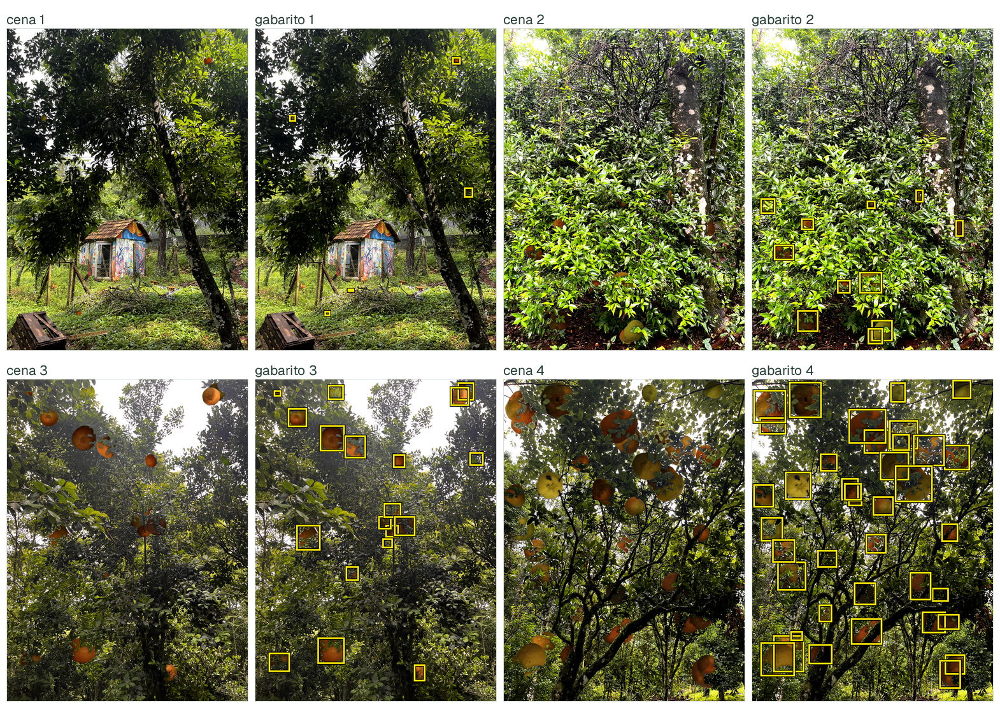

# Resultados dos detectores e exemplos de dados

**A grade está sendo regerada.** O gerador passou a exigir que toda fruta
composta renda um rótulo verificável, e essa mudança altera os conjuntos
sintéticos. Os números anteriores descreviam um gerador que não existe mais,
então foram retirados em vez de mantidos com ressalva.

O protocolo de treino permanece o de
[`configs/confirmatory.yaml`](../configs/confirmatory.yaml): 7 condições ×
3 detectores × 2 sementes, num total de 42 execuções que compartilham 50
épocas, `imgsz` 960, `batch` 8, `freeze: 5`, `mosaic` 1.0 com `close_mosaic` 5
e as mesmas augmentações de cor. Nenhum hiperparâmetro varia por condição ou
por detector.

| Conjunto de avaliação | Composição | Papel e limite |
|---|---|---|
| CitDet | 119 imagens e 10.082 caixas do split oficial de teste do [CitDet](https://robotic-vision-lab.github.io/citdet/) | Coleta externa. Suas estatísticas orientaram ajustes de escala e densidade do gerador; portanto, não é um teste intocado pelo desenvolvimento. |
| `manual_full_val` | 26 imagens e 451 caixas da validação de `manual-full` | Avaliação local. Essas imagens selecionaram os checkpoints de `manual-full`, por isso essa condição não tem uma estimativa independente neste conjunto. |

O viés de seleção do `manual_full_val` foi medido comparando o checkpoint
escolhido com o último de cada execução: **+0,0039** de mAP@.50:.95 a favor de
`manual-full`, contra +0,0004 nas condições sintéticas, que selecionam na
própria validação sintética.

## Como reproduzir

Além do fluxo padrão do [`README.md`](../README.md#execução), os dois conjuntos
de avaliação foram registrados em `external_datasets` de
[`configs/pipeline.yaml`](../configs/pipeline.yaml) (`citdet`, já documentado no
README, e `manual_full_val`, que aponta para o próprio split de validação do
`manual-full`) e avaliados sem retreinar nada:

```bash
./run_pipeline.sh test --device 0 --unlock-test --external-name citdet
./run_pipeline.sh test --device 0 --unlock-test --external-name manual_full_val
./run_pipeline.sh report --external-name citdet
./run_pipeline.sh report --external-name manual_full_val
.venv/bin/python scripts/plot_confirmatory_results.py
```

O gráfico sai dos JSONs por execução em `artifacts/confirmatory`, que ficam
fora do Git e acompanham o gerador vigente. Relatórios completos com curvas de treino e CSVs detalhados:
`artifacts/confirmatory/RESULTS_citdet.md` e `RESULTS_manual_full_val.md`.

### Baixar os pesos treinados (sem retreinar)

Os 42 checkpoints publicados como asset de release **precedem a regeração** e
não correspondem a nenhuma tabela desta página; servem para reexecutar a
avaliação do gerador anterior, não para reproduzir resultados atuais. São
validados por
SHA-256 em [`configs/pipeline.yaml`](../configs/pipeline.yaml) (`confirmatory_checkpoints`).
Num computador novo, depois de preparar os dados (`./run_pipeline.sh prepare
--device 0 --accept-data-terms`, que só baixa/organiza dados, sem treinar):

```bash
.venv/bin/python scripts/download_weights.py
```

Isso baixa o ZIP, valida o hash, extrai cada checkpoint em
`runs/confirmatory/training/<run_id>/weights/best.pt` e escreve
`artifacts/confirmatory/model_selection.json` já com os caminhos corrigidos
para a máquina local (os caminhos originais são absolutos e específicos de
onde o treino rodou). A partir daí, `evaluate_test.py`, `generate_report.py` e
`scripts/plot_confirmatory_results.py` funcionam normalmente contra qualquer
teste externo novo, sem rodar `train`/`select`:

```bash
./run_pipeline.sh prepare-test --external-name <nome> --external-source <arquivo>
./run_pipeline.sh test --device 0 --unlock-test --external-name <nome>
./run_pipeline.sh report --external-name <nome>
```

Release: https://github.com/Kastango/synthetic-fruit-detection-dataset-generation/releases/tag/confirmatory-checkpoints

## Exemplos de dados sintéticos

Cenas de `synthetic-3x`, o mesmo subconjunto usado nos treinamentos acima,
geradas com semente raiz 42. A seleção usa os quantis
25%, 50%, 75% e 97% da contagem de caixas nas 390 cenas, com desempate pelo
índice de geração; não usa resultados de detector nem seleção estética.
As cenas sem caixas permitem inspecionar problemas de inserção, escala e
iluminação que as métricas não resumem.

[](figures/results/sheets/cenas-sinteticas.jpg)

A folha alterna cena composta e gabarito automático, nos quantis 25%, 50%,
75% e 97% da contagem de caixas (11, 20, 30 e 104 frutas).

Reproduza a exportação com `.venv/bin/python scripts/render_synthetic_examples.py`.
O dataset deve estar gerado conforme o [guia do estúdio](GENERATOR_STUDIO.md).
O [registro de origem](figures/results/synthetic-examples/provenance.json)
preserva sementes por cena, hashes, índices e a regra de seleção.

## Rastreabilidade

- O bloqueio da avaliação após `model_selection.json` não desfaz o uso prévio
  de estatísticas no gerador nem o reuso da validação manual para seleção.
- Cada execução registra `dataset_fingerprint`, e cada pool registra
  `config_hash`, `asset_catalog_fingerprint` e `generator_sha256`. Conferir
  esses campos contra o disco é o primeiro passo para saber se uma tabela
  ainda descreve o gerador vigente.

